# Hermes Supporting Applications

**Author:** Jacob Cowan
**Last Updated:** June 20, 2026 (audit pass — v0.17.0 live, port corrections, desktop gateway)
**Status:** Live — full operational stack

> Every app here exists for a reason. None are decoration. Together they transform Hermes from "AI in a box" into a **persistent, self-aware, documented operator** — the kind of setup most people don't have because it requires deliberate architecture, not just a one-click deploy.

---

## Why This Stack Is Different

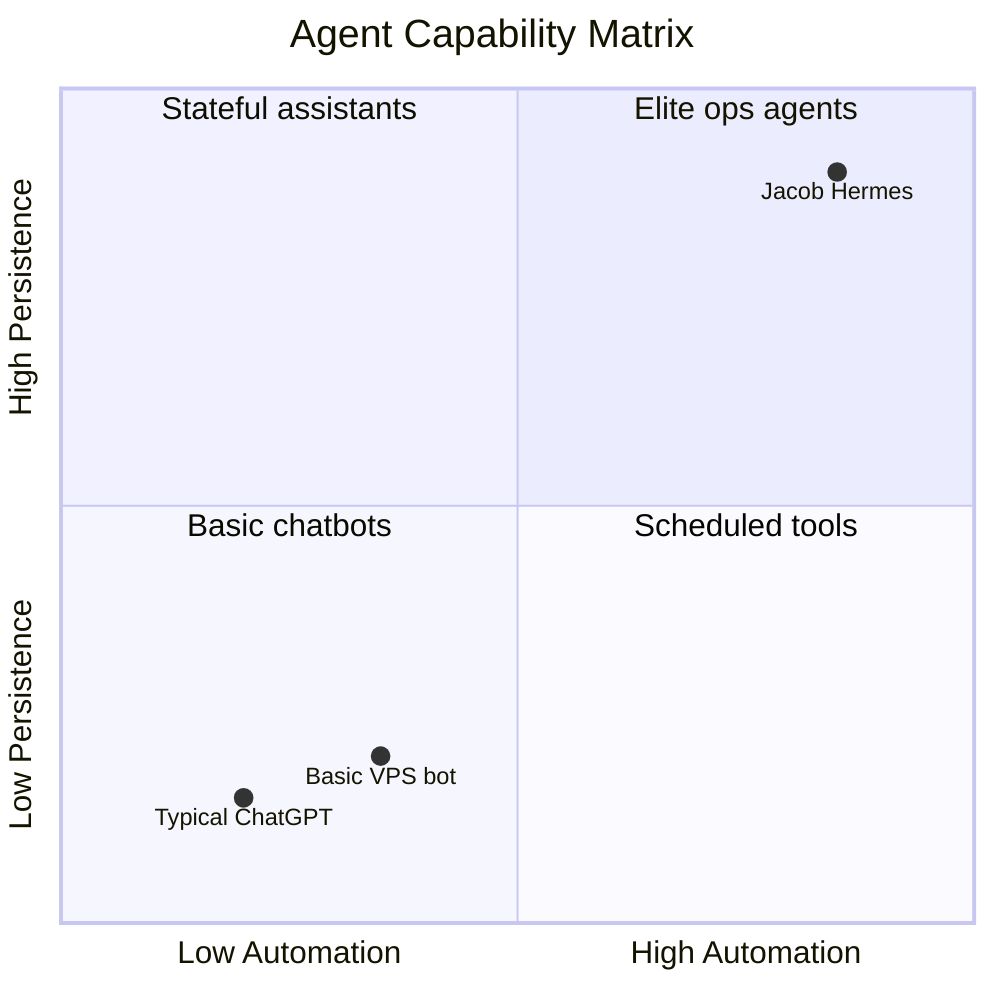

| Layer | What most people skip | What Jacob built |
|-------|----------------------|------------------|
| **Memory** | Session-only context | agentmemory — facts survive reboots |
| **Knowledge** | Model training cutoff | Chroma — live-indexed VPS + course docs |
| **Ops** | Manual health checks | Crons + `stack_status.sh` + familiarization |
| **Observability** | Find out when it's down | Uptime Kuma + Beszel + Netdata |
| **Governance** | Ad-hoc paths | Path audit, canonical reference, skills |

---

## Full Stack Architecture

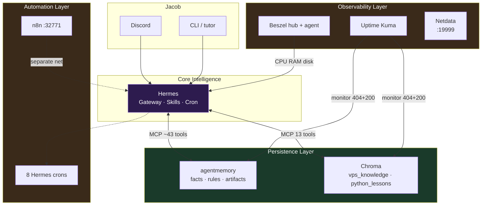

---

## App-by-App Deep Dive

### 1. Hermes — The Operator

**Container:** `hermes-agent-0qzm-hermes-agent-1`
**Purpose:** Central AI agent — Discord gateway, cron scheduler, MCP client hub, skill loader.

**Why it matters:**
Hermes is not deployed and forgotten. It **runs** the VPS: Sunday familiarization refreshes its own knowledge, Monday briefs Jacob on Discord, daily security watchdog interprets alerts, and Chroma re-indexes docs before the familiarization run. Custom skills (`vps-ops`, `chroma-rag`, `security-ops`) encode operational procedures so Hermes doesn't improvise dangerous commands.

**What makes it stand out:**
- Provider fallback chain (DeepSeek → OpenRouter → Anthropic → Google) — resilience
- No `docker.sock` — security by design; uses `docker_ps.snapshot` instead
- Documented canonical paths — Hermes knows *where* things live without asking Jacob
- Python tutor integrated via workdir + `python_lessons` Chroma collection

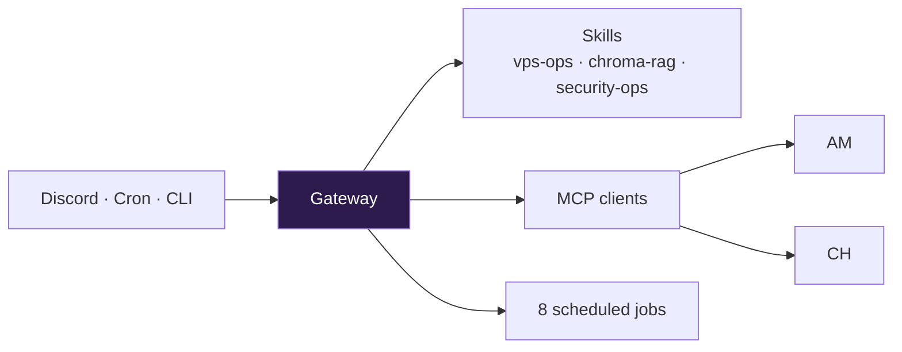

| Surface | Port | Access |
|---------|------|--------|
| Dashboard | 4860 | Traefik + basic auth |
| Filebrowser | 4861 | SSH LocalForward only |
| Discord | — | Always-on bot |

---

### 2. agentmemory — Persistent Memory

**Container:** `agentmemory-o72l-agentmemory-1`
**URL:** `http://agentmemory-o72l-agentmemory-1:3111/`
**Health:** HTTP **404** on `/` = healthy (no root route)

**Purpose:** Store cross-session facts, procedural rules, and run artifacts. When Jacob says "remember I work on CareConnectLite" or Hermes learns container names during familiarization, it goes here — not into Chroma, not into the model's fleeting context window.

**Why it matters:**
Without agentmemory, every Discord conversation starts cold. Jacob would re-explain the VPS layout, project priorities, and cron schedules weekly. agentmemory is the **continuity layer** — the difference between a tool and a teammate.

**Why Hermes stands out:**
Most agents conflate "memory" with "RAG." Jacob's stack separates them deliberately:
- agentmemory = *what Jacob told Hermes to remember*
- Chroma = *what's written in documentation*

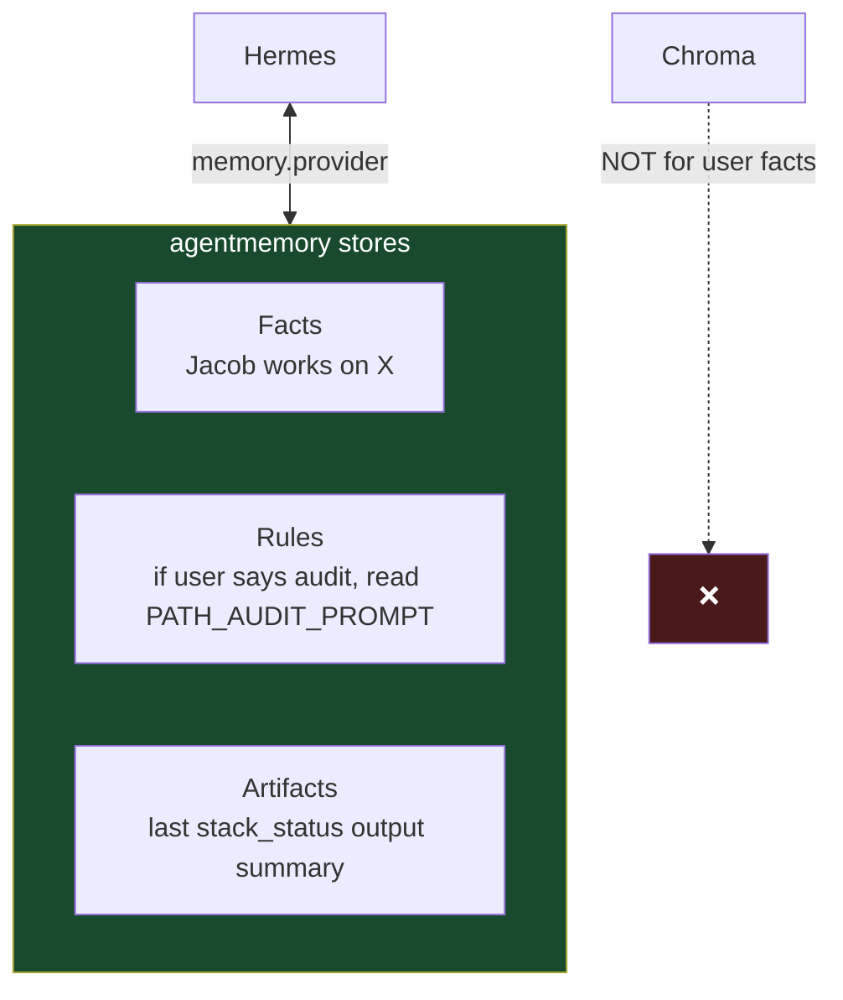

| Config | Value |
|--------|-------|
| MCP transport | `npx -y @agentmemory/mcp` |
| Memory provider | `agentmemory` in `config.yaml` |
| Auth | `AGENTMEMORY_SECRET` in `.env` |
| Tools | ~43 MCP tools |

---

### 3. Chroma — Institutional Knowledge (RAG)

**Container:** `chroma` (manual deploy)
**URL:** `http://chroma:8000/api/v2/heartbeat`
**Health:** HTTP **200**

**Purpose:** Semantic search over Jacob's documentation and Python course materials. When Hermes answers "how is agentmemory wired?" it queries `vps_knowledge` and returns real chunks from APPLICATIONS.md — not a guess.

**Why it matters:**
LLMs hallucinate setup steps. Chroma grounds answers in **indexed truth**. After doc edits, `chroma_bootstrap.py` re-indexes so Hermes never cites stale architecture.

**Why Hermes stands out:**
- Two live collections serving different roles (ops docs vs tutor content)
- Client-side embeddings (`all-MiniLM-L6-v2`, 88 MB) — no API cost for doc search
- Wired via MCP with 13 tools — Hermes calls `chroma_query_documents` directly
- Sunday 04:00 auto re-index before familiarization cron

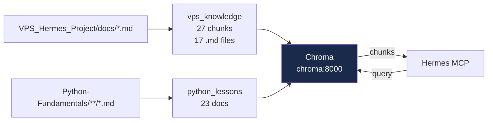

| Collection | Docs | Source |
|------------|------|--------|
| `vps_knowledge` | 27 chunks (17 `.md` files) | `/opt/data/Projects/VPS_Hermes_Project/docs/` |
| `python_lessons` | 23 | `/opt/data/Projects/Python-Fundamentals/` |

**Re-index:**
```bash
/opt/hermes/.venv/bin/python3 /opt/data/bin/chroma_bootstrap.py
```

> **Note:** Hostinger offers a catalog Chroma deploy for rebuilds. Current instance is manual — do not deploy a second Chroma without migration.

---

### 4. Uptime Kuma — Reliability Guard

**Container:** `uptime-kuma-fl0m-uptime-kuma-1`
**URL:** `http://uptime-kuma-fl0m-uptime-kuma-1:3001/`
**Health:** HTTP **302**

**Purpose:** External HTTP monitoring of critical services. If agentmemory or Chroma stops responding, Jacob knows before Hermes silently loses memory and RAG capability.

**Why it matters:**
Hermes can *feel* healthy while its dependencies are down. Uptime Kuma watches the actual endpoints Hermes depends on — including the counterintuitive agentmemory 404 check.

**Why Hermes stands out:**
Monitors are configured for **correct** health semantics, not naive "200 only":

| Monitor | URL | Expected | Why |
|---------|-----|----------|-----|
| agentmemory | `:3111/` | **404** | No root route — 404 means process is up |
| Chroma | `:8000/api/v2/heartbeat` | **200** | API heartbeat |

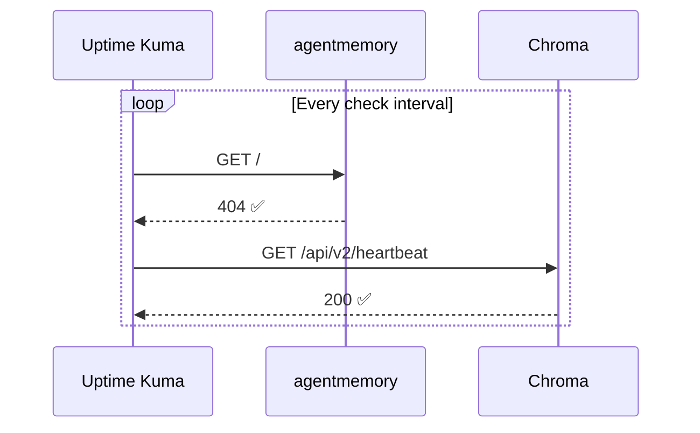

---


### Desktop App — Remote Gateway

**URL:** `http://<VPS_TAILSCALE_IP>:32787`
**Auth:** `HERMES_DASHBOARD_BASIC_AUTH_USERNAME` / `HERMES_DASHBOARD_BASIC_AUTH_PASSWORD` in `/opt/data/.env`
**Setting:** Hermes Desktop → Settings → Gateway → **Remote gateway**

The Hermes desktop Mac app can connect directly to the VPS backend — all config, skills, crons, memory, and provider fallbacks remain on the VPS. The desktop app is a thin UI shell only.

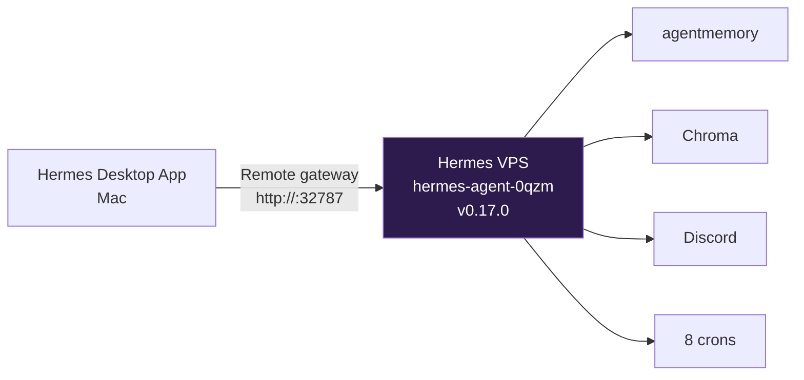

| Item | Value |
|------|-------|
| Remote URL | `http://<VPS_TAILSCALE_IP>:32787` |
| Protocol | HTTP (plain — `HERMES_DASHBOARD_INSECURE=true` in `.env`) |
| Auth method | Username / password (dashboard basic auth) |
| Session limit | 4 concurrent (bumped June 20 from 2) |
| Desktop client version | v0.17.0 |
| VPS backend version | v0.17.0 (must match — version mismatch causes liveness probe 404 = "session expired") |

**Version match is critical:** Desktop `v0.17.0` calls `/api/fs/list` — a 404 on this endpoint means the VPS backend is on an older version. Run `hermes --version` inside the container to verify.

**If session expires after container restart:**
Settings → Gateway → Sign in — the URL is saved, just re-authenticate.

---

### 5. Beszel — Capacity Awareness

**Containers:** `beszel-kmwv-beszel-1` (hub) + `beszel-agent` (host)
**URL:** `http://beszel:8090/api/health`
**Health:** HTTP **200**

**Purpose:** Real-time host CPU, RAM, and disk metrics. On an 8 GB KVM, running Hermes + agentmemory + Chroma + Uptime Kuma + embedding caches means RAM pressure is real. Beszel shows trends before the box swaps or OOMs.

**Why it matters:**
Jacob's stack runs ~20 GB of Docker images and ~7 GB of Hermes `/opt/data` (mostly uv/npm caches). Beszel answers "are we about to run out of room?" before services degrade.

**Why Hermes stands out:**
Hermes joined `beszel-kmwv_default` so `stack_status.sh` can probe Beszel health from inside the container — one script, full stack picture.

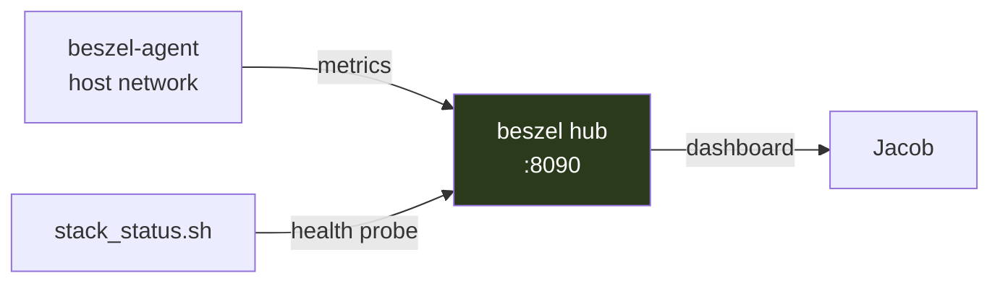

---

### 6. Filebrowser — Secure File Access

**Runs inside:** Hermes container on `:4861`
**Access:** `ssh -fN vps` → `http://localhost:4861`

**Purpose:** Web UI to browse `/opt/data` without exposing a file port to the internet.

**Why it matters:**
Jacob needs to read docs, check logs, and verify configs. Filebrowser provides that — but only through an SSH tunnel, not a public URL. Security and convenience together.

---


### 7. Netdata — Deep Performance Monitoring

**Container:** `netdata` (VPS host Docker)
**Tailscale UI:** `http://<VPS_TAILSCALE_IP>:19999`
**Mac app:** Netdata Server Monitoring (App Store) → add server URL above
**Health:** `GET /api/v1/info` → **200**

**Purpose:** Second-by-second host and container metrics — CPU, RAM, disk I/O, network, per-process drill-down. Complements Beszel (host trends) and Uptime Kuma (up/down).

**Storage:** Docker volumes `netdata-config`, `netdata-lib`, `netdata-cache`

| Access | URL |
|--------|-----|
| Mac app / browser (Tailscale) | `http://<VPS_TAILSCALE_IP>:19999` |
| Hermes internal probe | `http://netdata:19999/api/v1/info` |

> Bound to Tailscale IP only — not exposed to public internet. Read-only `docker.sock` for container metrics.

**Mac access (pick one):**
| Method | Steps |
|--------|-------|
| Chrome Install as App | Open `http://<VPS_TAILSCALE_IP>:19999` → ⋮ → "Install page as app" → name `Netdata Agent \| VPS_Hermes_Project` |
| App Store | Netdata Server Monitoring → add server URL above |
| Browser | Same URL — full dashboard |

**Discord alerts:** Private channel `#netdata` — WARNING / CRITICAL / CLEAR via `health_alarm_notify.conf` (webhook in `netdata-config` volume, not in git).

**Custom alerts** (`/etc/netdata/health.d/vps-hermes-project.conf`):
| Alarm | Warn | Crit |
|-------|------|------|
| `vps_ram_high` | 75% | 88% |
| `vps_disk_root_high` | 80% | 90% |

**Netdata Cloud:** Optional — skip for self-hosted; local dashboard is complete.

**Security:** Bound to Tailscale IP only. **Do not** open port 19999 on Hostinger public firewall.

---

### 8. n8n — Workflow Automation

**Container:** `n8n-eywu-n8n-1`
**Deployed:** June 19, 2026 (Hostinger one-click)
**Volume:** `n8n-eywu_n8n_data` → `/home/node/.n8n`

**Purpose:** Visual, deterministic automation — API glue, schedules, webhooks. Complements Hermes AI crons (reasoning) with repeatable if-this-then-that flows.

| Access | URL | Notes |
|--------|-----|-------|
| **Mac (Tailscale)** | `http://<VPS_TAILSCALE_IP>:32771` | Host port maps to container `:5678` |
| **Hostinger public** | `<n8n-public-webhook-url-redacted>` | Auto-provisioned by catalog |
| **Hermes container** | Not reachable | Separate Docker network `n8n-eywu_default` |

**Timezone:** `TZ=America/Chicago` in container — matches Jacob's wall clock (unlike VPS host UTC).

**Security posture (live):**

| Item | Status |
|------|--------|
| Host bind | `0.0.0.0:32771` — edge-blocked by Hostinger firewall |
| Public URL | Hostinger subdomain — intended for webhooks |
| Tailscale UI | Preferred for Jacob's admin access |

**Open hardening:** Rebind host port to `<VPS_TAILSCALE_IP>:32771` when Jacob approves (see [SECURITY.md](SECURITY.md#planned-hardening--tailscale-only-admin-uis)).

---

## Hermes Skills — Operational Playbooks

Skills encode *how* Hermes should behave. This is another differentiator — most deployments rely on system prompts alone.

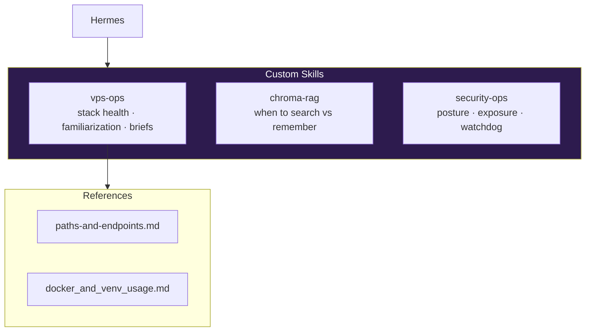

| Skill | Purpose | Why elite |
|-------|---------|-----------|
| `vps-ops` | Stack operator duties | Hermes runs familiarization, knows 404=healthy, uses canonical paths |
| `chroma-rag` | RAG routing guide | Prevents using Chroma as memory — architectural discipline |
| `security-ops` | VPS security posture | Firewall, exposure, watchdog — not project RAG |

Path: `/opt/data/skills/` · Canonical reference: `vps-ops/references/paths-and-endpoints.md`

---

## Scheduled Automation

```mermaid
gantt
    title Hermes Cron Timeline (UTC · CDT = UTC−5 summer)
    dateFormat HH:mm
    axisFormat %H:%M

    section Sunday
    chroma-reindex 04:00       :04:00, 30m
    stack-familiarization 05:00 :05:00, 45m

    section Daily
    security-watchdog 06:30    :06:30, 15m
    python-course-scan 09:00   :09:00, 30m
    6am CDT block 11:00 UTC    :11:00, 25m

    section Monday
    weekly-ops-brief 08:00     :08:00, 30m
```

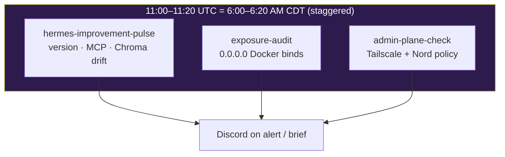

| Cron | Schedule | Script | Purpose | Why elite |
|------|----------|--------|---------|-----------|
| `chroma-reindex` | Sun 04:00 | `chroma_reindex.sh` | Re-index all collections | Docs stay searchable before familiarization |
| `stack-familiarization` | Sun 05:00 | `stack_status.sh` | Refresh agentmemory + brief | Hermes re-learns its own stack weekly |
| `security-watchdog` | Daily 06:30 | `security_watchdog_discord.sh` | Alert on problems only | Noise-free security monitoring |
| `python-course-scan` | Daily 09:00 | (agent) | Append tutor resources | Course grows without Jacob curating |
| `weekly-ops-brief` | Mon 08:00 | `stack_status.sh` | Discord summary | Proactive ops communication |
| `hermes-improvement-pulse` | Daily 11:00 UTC (**6am CDT**) | `hermes_improvement_check.sh` | Version, MCP, Chroma/git drift → one action | Makes Hermes better |
| `exposure-audit` | Daily 11:10 UTC (**6:10am CDT**) | `exposure_audit_discord.sh` | `0.0.0.0` Docker bind audit | VPS security hardening |
| `admin-plane-check` | Daily 11:20 UTC (**6:20am CDT**) | `admin_plane_check.sh` | Mac/VPS Tailscale + Nord policy | Nord + Tailscale coexistence |

**Host cron (not in jobs.json):** `tailscale status` → snapshot every 30m (feeds `admin-plane-check`).

---

## Service Endpoints Summary

| Service | Docker DNS URL | Healthy | Role |
|---------|----------------|---------|------|
| Hermes gateway | `hermes gateway status` | running | Orchestrator |
| agentmemory | `http://agentmemory-o72l-agentmemory-1:3111/` | 404 | Memory |
| Chroma | `http://chroma:8000/api/v2/heartbeat` | 200 | RAG |
| Beszel | `http://beszel:8090/api/health` | 200 | Metrics |
| Uptime Kuma | `http://uptime-kuma-fl0m-uptime-kuma-1:3001/` | 302 | Uptime |
| Netdata | `http://<VPS_TAILSCALE_IP>:19999` (Mac) · `http://netdata:19999` (internal) | 200 | Deep metrics |
| n8n | `http://<VPS_TAILSCALE_IP>:32771` (Mac) | 200/302 | Workflow automation |

```bash
/opt/data/bin/stack_status.sh
```

---

## MCP Wiring

| Server | Tools | Connects to | Role |
|--------|-------|-------------|------|
| agentmemory | ~43 | `:3111` | Memory read/write |
| chroma | 13 | `chroma:8000` | Document search |

Reload after config change: `/reload-mcp` in Discord.

---

## Projects Supported

| Project | agentmemory | Chroma | Ops automation |
|---------|-------------|--------|----------------|
| VPS_Hermes_Project | Stack facts, cron rules | `vps_knowledge` | Full cron suite |
| Python Fundamentals | Lesson progress | `python_lessons` | Daily resource scan |
| CareConnectLite | DB project context | — | SQLAlchemy in venv |

---

## Storage Layout — Per-App Folders

**Project:** `VPS_Hermes_Project` — git repo, docs, and filesystem folder aligned.

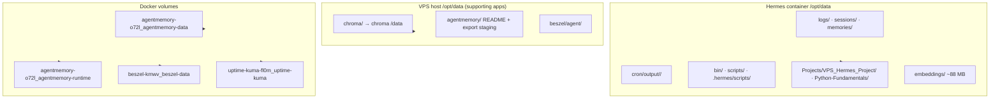

| Application | Storage location | Output/shared? |
|-------------|------------------|----------------|
| **Hermes** | `logs/`, `sessions/`, `memories/`, `state.db` | Per-service runtime folders |
| **Hermes cron** | `cron/output/<job-id>/` — timestamped `.md` per run | Per-job output folders |
| **Hermes ops** | `bin/` (manual), `scripts/` (cron), `.hermes/scripts/` (source) | Shared ops — sync before cron |
| **VPS_Hermes_Project** | `Projects/VPS_Hermes_Project/docs/` + `config/` | Git backup mirror |
| **Python Fundamentals** | `Projects/Python-Fundamentals/` | Project workdir |
| **Chroma** | Host `/opt/data/chroma/` → container `/data` | Dedicated vector store |
| **Chroma embeddings** | Hermes `/opt/data/embeddings/` | Shared HF cache for chroma-mcp |
| **agentmemory** | Volumes `agentmemory-o72l_agentmemory-data` + `agentmemory-o72l_agentmemory-runtime` | Dedicated — not in Hermes tree |
| **agentmemory (host)** | Host `/opt/data/agentmemory/` | Org folder — exports/backups only |
| **Beszel hub** | Volume `beszel-kmwv_beszel-data` | Dedicated hub config |
| **Beszel agent** | Host `/opt/data/beszel/agent/` | Dedicated agent state |
| **Uptime Kuma** | Volume `uptime-kuma-fl0m_uptime-kuma` | Dedicated monitor config |
| **n8n** | Volume `n8n-eywu_n8n_data` | Workflows, credentials, execution history |

**Cron output folders:**

| Job | Folder |
|-----|--------|
| `security-watchdog` | `/opt/data/cron/output/3afb730fa195/` |
| `stack-familiarization` | `/opt/data/cron/output/a243101413ad/` |
| `python-course-scan` | `/opt/data/cron/output/c372ad1ed64d/` |

## Storage & Backup Priorities

| Path | Back up? | Contents |
|------|----------|----------|
| `/opt/data/.env` | ✅ offline only | All secrets |
| Chroma host `/opt/data/chroma/` | ✅ | Vector collections |
| agentmemory volumes (`agentmemory-o72l_*`) | ✅ | User memories |
| `/opt/data/embeddings/` | Optional | Re-downloads (~88 MB) |
| `/opt/data/.cache/uv` | No | Regenerates (5+ GB cache) |
| Beszel / Uptime Kuma / n8n volumes | ✅ with stack | Monitor + hub + workflow config |

---

## Candidate Applications (Hostinger catalog)

> **Deployed:** n8n (June 19). **Not deployed:** 9router, Ackee. Hermes must follow APP_INSTALL_POLICY.md before any new install.

| App | Purpose | Status | Deploy notes |
|-----|---------|--------|--------------|
| **n8n** | Visual workflow automation | ✅ **Live** | Tailscale `http://<VPS_TAILSCALE_IP>:32771`; public `<n8n-public-webhook-url-redacted>` |
| **9router** | LLM proxy; token compression; multi-provider fallback | Not deployed | Bind `<VPS_TAILSCALE_IP>:20128` only if added |
| **Ackee** | Privacy-focused web analytics | Not deployed | Only if Jacob has public sites to track |

**Not protection layers:** Ackee = visitor privacy analytics. 9router = cost/routing. Real admin hardening = Tailscale-only port binding ([SECURITY.md](SECURITY.md#planned-hardening--tailscale-only-admin-uis)).

---

## Change Log

| Date | Change |
|------|--------|
| 2026-06-18 | agentmemory + Chroma MCP wired; Phases 1–3 |
| 2026-06-18 | Path audit; canonical paths; ops crons |
| 2026-06-18 | Python packages: pandas, sqlalchemy, pytest |
| 2026-06-19 | Deep documentation pass — purpose + differentiation |
| 2026-06-19 | Netdata deployed — Tailscale :19999, Mac app ready |
| 2026-06-19 | n8n deployed via Hostinger (`n8n-eywu-n8n-1`, `:32771`) |
| 2026-06-19 | 9router, Ackee evaluated — not deployed |
| 2026-06-19 | Hermes v0.17.0 live (in-container upgrade 2026-06-20) — upgrade path in HERMES_VPS_SETUP.md |
| 2026-06-20 | Desktop app remote gateway connected — http://<VPS_TAILSCALE_IP>:32787 (Settings → Gateway → Remote gateway) |
| 2026-06-20 | v0.17.0 in-container upgrade (Hostinger image still 0.16.0); ⚠ force-recreate resets to 0.16.0 — re-run: uv pip install --force-reinstall hermes-agent + chown -R hermes:hermes /opt/hermes/.venv; new dashboard port = :32787 |
| 2026-06-19 | Chroma re-index — vps_knowledge=27, python_lessons=23 |
| 2026-06-19 | 3 new crons: improvement-pulse, exposure-audit, admin-plane-check |
| 2026-06-19 | New crons staggered 11:00/11:10/11:20 UTC (6:00–6:20 AM CDT) |

---

*Last audited: June 19, 2026 (final pass — 8 crons)*
*See also: [README.md](README.md) · [Architecture.md](Architecture.md)*
