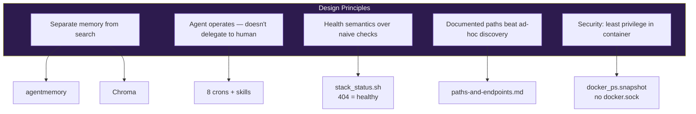
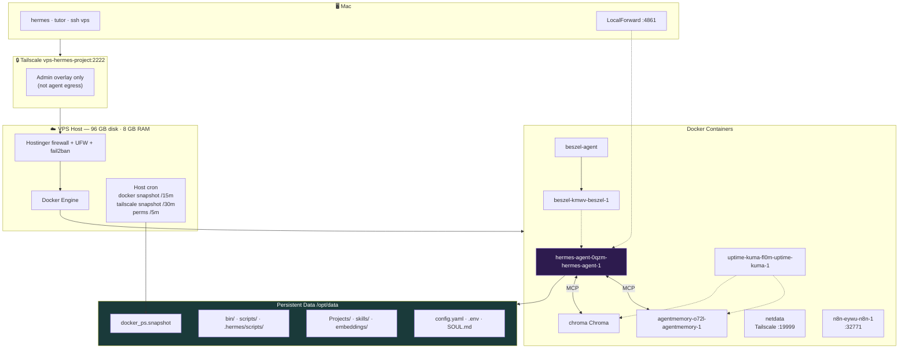
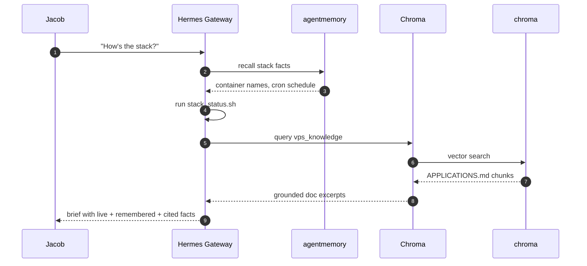
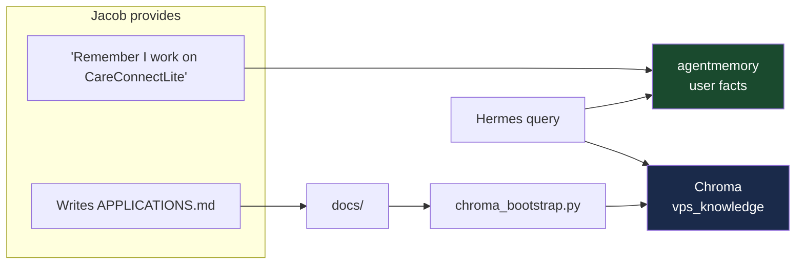
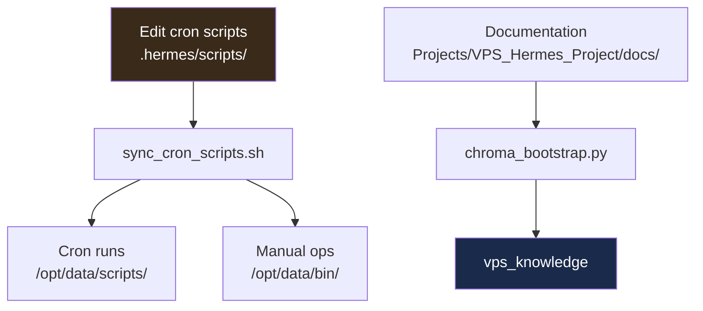
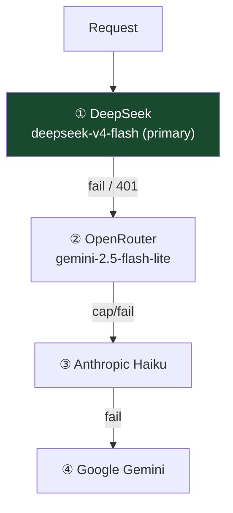
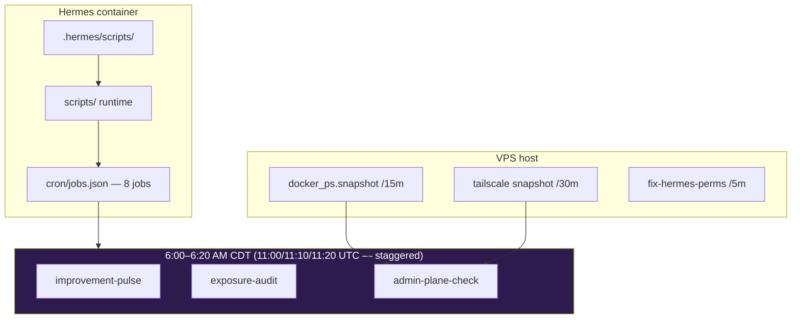

# Hermes VPS Architecture

**Project:** `VPS_Hermes_Project`  

**Author:** Jacob Cowan
**Last Updated:** June 19, 2026 (final pass)
**Status:** Live — path audit verified

> Architecture of a **self-operating AI stack**. Not just containers on a VPS — a deliberate design where memory, knowledge, monitoring, and automation reinforce each other.

---

## Design Philosophy



| Principle | Implementation | Why elite |
|-----------|----------------|-----------|
| Memory ≠ search | agentmemory + Chroma as separate MCPs | No conflation — most agents dump everything into one RAG bucket |
| Self-operating | Crons, skills, familiarization | Hermes maintains awareness without Jacob re-prompting |
| Correct health | 404=OK for agentmemory | Monitors match reality — false alarms don't train ignore |
| Canonical paths | Three-tier script layout + snapshot | Hermes runs ops from inside container safely |
| Least privilege | No docker.sock in Hermes | Compromised agent can't start/stop arbitrary containers |

---

## Full Stack Diagram



---

## Service Inventory

| Service | Container | Endpoint | Healthy | Purpose |
|---------|-----------|----------|---------|---------|
| Hermes | `hermes-agent-0qzm-hermes-agent-1` | gateway | running | AI operator — Discord, cron, MCP |
| agentmemory | `agentmemory-o72l-agentmemory-1` | `:3111/` | **404** | Persistent memory |
| Chroma | `chroma` | `:8000/heartbeat` | **200** | Document RAG |
| Beszel | `beszel-kmwv-beszel-1` | `beszel:8090/health` | **200** | Host metrics |
| Uptime Kuma | `uptime-kuma-fl0m-uptime-kuma-1` | `:3001/` | **302** | HTTP monitors |
| Beszel agent | `beszel-agent` | host network | — | Stats collector |
| Netdata | `netdata` | `netdata:19999` / Tailscale `:19999` | **200** | Deep metrics + Discord alerts |
| n8n | `n8n-eywu-n8n-1` | `http://<VPS_TAILSCALE_IP>:32771` (Mac) | — | Workflow automation (separate Docker network) |

---

## MCP Data Flow



---

## Memory vs Knowledge — The Core Split



---

## Canonical Path Model



| Path | Role |
|------|------|
| `/opt/data/` | HERMES_HOME |
| `/opt/data/bin/` | Manual ops: `stack_status.sh`, `chroma_bootstrap.py` |
| `/opt/data/scripts/` | Cron runtime |
| `/opt/data/.hermes/scripts/` | Cron source + sync |
| `/opt/data/skills/vps-ops/references/paths-and-endpoints.md` | Canonical reference |
| `/opt/data/docker_ps.snapshot` | Container list (host-refreshed) |

---

## Provider Resilience



Four-provider fallback means Hermes stays online when any single API has quota issues — another ops maturity signal.

---

## Container Security Model

| Constraint | Reason |
|------------|--------|
| No docker.sock | Agent cannot control host containers |
| Non-root uid 10000 | Reduced blast radius |
| `.env` mode 600 | Secrets not world-readable |
| Filebrowser tunnel-only | No public file port |
| Secrets never in Chroma | Index contains docs only |

---

## Egress Model (live)

| Traffic | Path | VPN |
|---------|------|-----|
| Jacob → VPS | Tailscale → SSH `:2222` via `<VPS_TAILSCALE_IP>` | Tailscale (admin) |
| Hermes → APIs / web | Docker → host routing → internet | **None** (Hostinger IP) |
| NordVPN (Mac) | Reinstalled — **disconnect for VPS admin** | Breaks Tailscale when connected |

Inbound security is strong; outbound is **not anonymized**. See [SECURITY.md](SECURITY.md#egress--vpn-posture-live-june-19-2026).

---

## Timezones

| Location | Zone | Impact |
|----------|------|--------|
| VPS host | **UTC** | Cron schedules, logs, OpenRouter $1/day cap reset at UTC midnight |
| Jacob's Mac | `America/Chicago` (CDT) | Wall-clock for daily work |

Convert before editing `cron/jobs.json`: **CDT + 5 hours = UTC** (summer).

---

## Version & Upgrade Path

| | |
|--|--|
| **Live** | Hermes v0.16.0 in `hermes-agent-0qzm-hermes-agent-1` |
| **Target** | [v0.17.0 (v2026.6.19)](https://github.com/NousResearch/hermes-agent/releases/tag/v2026.6.19) |
| **Procedure** | [HERMES_VPS_SETUP.md](HERMES_VPS_SETUP.md#version--upgrade) |

---

## Automation Layers



---

## Health Check

```bash
/opt/data/bin/stack_status.sh
```

---

*Last audited: June 19, 2026 (final pass — 8 crons)*
*See also: [APPLICATIONS.md](APPLICATIONS.md) · [README.md](README.md)*
