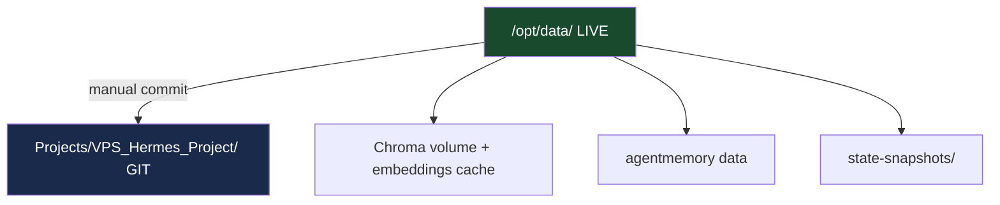
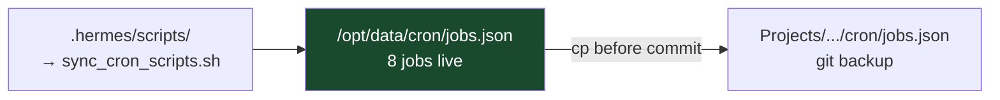

# Hermes Backup Guide

**Last Updated:** June 19, 2026

---

## Overview



| Layer | Path | Purpose |
|-------|------|---------|
| **Live** | `/opt/data/` (Hermes container) | Hermes reads here only |
| **Git backup** | `/opt/data/Projects/VPS_Hermes_Project/` (`VPS_Hermes_Project` repo) | Docs + config mirror |
| **Chroma data** | Host `/opt/data/chroma/` + Hermes `/opt/data/embeddings/` | Vectors + model cache |
| **agentmemory** | Volumes `agentmemory-o72l_agentmemory-data` + `agentmemory-o72l_agentmemory-runtime` | Cross-session memory |
| **Beszel hub** | Volume `beszel-kmwv_beszel-data` | Hub config |
| **Beszel agent** | Host `/opt/data/beszel/agent/` | Agent state |
| **Uptime Kuma** | Volume `uptime-kuma-fl0m_uptime-kuma` | Monitor definitions |
| **Netdata** | Volumes `netdata-config`, `netdata-lib`, `netdata-cache` | Metrics + alert config (webhook in config volume) |
| **Cron output** | `/opt/data/cron/output/<job-id>/` | Per-job run artifacts |

**Git push policy:** Wait for Hermes path verification, then Jacob approves.

---

## What Gets Committed

✅ `docs/*.md` · `config/` · `hooks/` · `cron/jobs.json` (8 jobs as of June 19)

🚫 `.env` · `logs/` · `skills/` · `state.db` · runtime locks

### `cron/jobs.json` — source of truth for Hermes schedules



After adding or editing crons, copy live → backup and commit. Cron **scripts** live in `.hermes/scripts/` and sync to `/opt/data/scripts/` — not always in `docs/`.

---

## Backup Procedure

```bash
docker exec -u hermes hermes-agent-0qzm-hermes-agent-1 sh -c '
  cd /opt/data/Projects/VPS_Hermes_Project
  git add -A
  git commit -m "backup: $(date +%Y-%m-%d)"
  git push origin main
'
```

---

## After Doc Edits — Re-index Chroma

Documentation changes are not searchable until re-indexed:

```bash
docker exec hermes-agent-0qzm-hermes-agent-1 \
  /opt/hermes/.venv/bin/python3 /opt/data/bin/chroma_bootstrap.py
```

Or wait for Sunday `chroma-reindex` cron (04:00 UTC).

---

## Restore

`/opt/data` survives container recreates via bind mount. Full wipe procedure unchanged — see git pull + manual `.env` restore.

---

## Critical Data to Back Up Outside Git

| Data | Why |
|------|-----|
| `/opt/data/.env` | All secrets — Apple Keychain / offline encrypted backup |
| Chroma persistence | Vector collections |
| agentmemory data | User facts and rules |
| Netdata `netdata-config` | Discord webhook + alert tuning |
| `state.db` | Hermes runtime state |

**Planned:** Backrest for encrypted automated backups.

---

*Last audited: June 19, 2026 (final pass — 8 crons, jobs.json)*
*See also: [Workflow.md](Workflow.md) · [APPLICATIONS.md](APPLICATIONS.md)*
