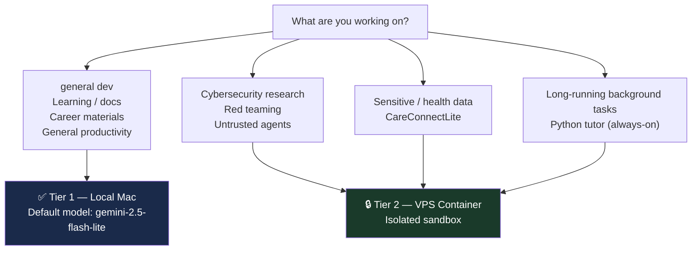

# Hermes Best Practices Guide

**Project:** `VPS_Hermes_Project`  

**Author:** Jacob Cowan
**Version:** 3.0 (Current)
**Last Updated:** June 19, 2026

---

## 1. Core Values (Non-Negotiable)

| Value | What It Means in Practice |
|-------|--------------------------|
| **AI Transparency** | Document AI usage in commits/notes; never submit work you don't understand |
| **Data Privacy** | Local Ollama for sensitive data; never send health data to cloud models |
| **Root-Cause Mindset** | Ask for reasoning, not just answers; use 5 Whys / fault tree analysis |
| **Security by Design** | VPS sandbox for risky work; never give AI unrestricted system access |
| **Continuous Learning** | Use Hermes to build understanding, not to skip it |
| **Professionalism** | High standards for code quality, docs, communication |

---

## 2. Tier Selection Framework



### Tier 1 (Local Mac) — Default
- general development
- Learning technical or cybersecurity concepts
- Resume, LinkedIn, cover letters, interview prep
- Writing, brainstorming, general productivity

### Tier 2 (VPS Container) — Conscious Choice
- Cybersecurity research or red teaming
- Running experimental or untrusted AI agents
- Any work involving sensitive or health data
- Long-running background tasks
- Python tutor sessions (24/7, always-on)

---

## 3. Prompting Framework

Use this structure for any significant prompt:

```
1. CONTEXT    — Background: project name, career transition, NDT experience
2. ROLE       — Specific expert persona (e.g., "senior cybersecurity architect")
3. TASK       — Concrete desired output
4. CONSTRAINTS — Values: root-cause analysis, privacy requirements, step-by-step
5. FORMAT     — Tables, numbered steps, code blocks, bullet lists
```

**Example (CareConnectLite):**
> "You are a senior full-stack engineer helping me build CareConnectLite (PostgreSQL, SQLAlchemy, data privacy). Using root-cause analysis, review this API route for security and performance issues. Structure: 1) Root cause, 2) Security findings, 3) Performance improvements, 4) Corrected code."

**Example (career transition):**
> "You are a tech career coach. I am transitioning from 10 years as an Advanced NDT Technician (Rope Access Level II, PAUT/ultrasonics, critical infrastructure) into Cybersecurity. Rewrite this resume bullet to highlight transferable skills for a SOC Analyst role. Keep it under 2 lines, confident and specific."

**Example (learning):**
> "Explain port scanning techniques (TCP SYN, connect, UDP) as if I'm an NDT technician learning what each scanning method 'sounds like' to a target system. Use an analogy to ultrasonic testing. Then give me 3 practice questions."

---

## 4. Project-Specific Rules

### CareConnectLite
- Default to Tier 1 (Mac) for most development
- Focus: clean code, accessibility, SEO, production readiness
- Document AI assistance in commit messages (`Co-authored with Hermes`)
- Never push untested API routes

### CareConnectLite
- **Local Ollama ONLY** — health data must never go to cloud models
- Use Tier 2 (VPS) if any real data processing or integration testing
- Privacy-by-design, data minimization, ethical design at every step

### Python Fundamentals Course
- Use `tutor` to launch (auto-loads AGENTS.md instructor brief)
- Check `PROGRESS.md` before each session to know where you are
- `RESOURCES.md` updates automatically — check it before web-searching

### Career Transition Materials
- Default to Tier 1 (Mac)
- Frame NDT skills as cybersecurity/IT narratives
- Professional, concise, confident tone
- Verify all content before submitting to employers

---

## 5. General Rules

- Never accept the first answer — ask for reasoning or alternatives
- Always verify code before running in production
- Run `docker exec $C hermes status` periodically on VPS
- Commit `/opt/data/Projects/VPS_Hermes_Project` to git after major config changes
- Keep this documentation hub updated after significant changes
- Be intentional about which tier and model you're using

---

## 6. Model Selection Guide

| Task Type | Recommended Model | Why |
|-----------|------------------|-----|
| Complex code review | `google/gemini-2.5-flash-lite` (OpenRouter) | Strong code reasoning |
| Fast Q&A / brainstorm | Any available primary | Speed matters |
| Security/red team | VPS container + OpenRouter | Isolated environment |
| Offline / sensitive | Ollama local (Mac) | No data leaves device |
| Creative writing | xAI Grok-4.3 | Strong narrative generation |

---

*Last Updated: June 19, 2026*

---

*Last audited: June 19, 2026* — see [INDEX.md](INDEX.md) for navigation.
