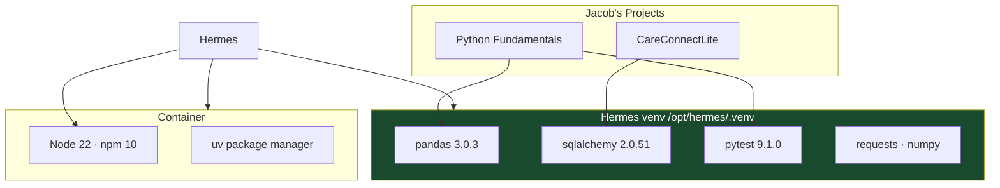
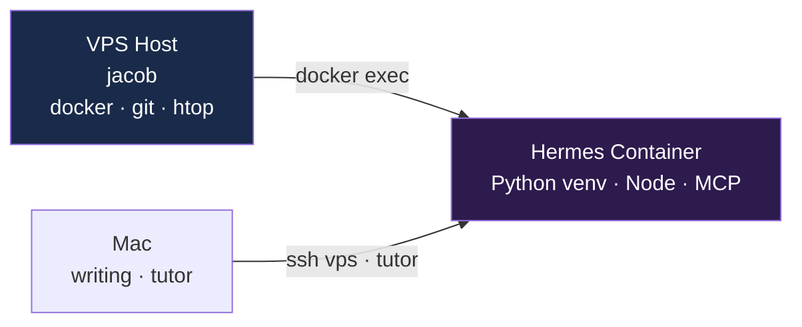

# Development Environment

**Project:** `VPS_Hermes_Project`  

**Author:** Jacob Cowan
**Last Updated:** June 19, 2026

> Tooling that lets Hermes help build — not just chat. Python packages for CareConnectLite and course work, Node for JS tasks, and a clear split between host and container capabilities.

---

## Why Dev Tooling Matters for a Top-Tier Hermes

A basic agent answers questions. Jacob's Hermes **executes** — runs pytest, manipulates data with pandas, models DB schemas with SQLAlchemy, and assists with Node when needed. The venv is a deliberate capability layer.



---

## Environment Split



| Run here | When |
|----------|------|
| Hermes container | Cron, Discord tasks, Python tutor, Chroma, scripting |
| VPS host | `docker ps`, snapshot refresh, system monitoring |
| Mac | Tier 1 writing, local `hermes` CLI, `tutor` alias |

---

## Python Environment

**Interpreter:** `/opt/hermes/.venv/bin/python3` (3.13.5)

**Install:**
```bash
uv pip install --python /opt/hermes/.venv/bin/python3 <package>
```

| Package | Version | Project use |
|---------|---------|-------------|
| pandas | 3.0.3 | Data analysis, scripting |
| sqlalchemy | 2.0.51 | CareConnectLite ORM |
| pytest | 9.1.0 | Test writing and execution |
| numpy | 2.4.6 | Numerics |
| requests | 2.33.0 | HTTP/API calls |
| chromadb | venv | Bootstrap + MCP |
| sentence-transformers | venv | Chroma embeddings |

---

## Host Tools

| Tool | Status | Notes |
|------|--------|-------|
| docker + compose | ✅ | Container management |
| git, curl, jq, htop | ✅ | Standard ops |
| python3-dev | ✅ | Native builds on host |
| postgresql-client | ❌ | Add when CareConnectLite DB defined |
| node/npm (host) | ❌ | Use container Node 22 |

---

## Hermes Container Limits

| Blocked | Use instead |
|---------|-------------|
| `docker ps` | `cat /opt/data/docker_ps.snapshot` |
| Host `apt` from container | SSH to host as jacob |

---

*Last audited: June 19, 2026*