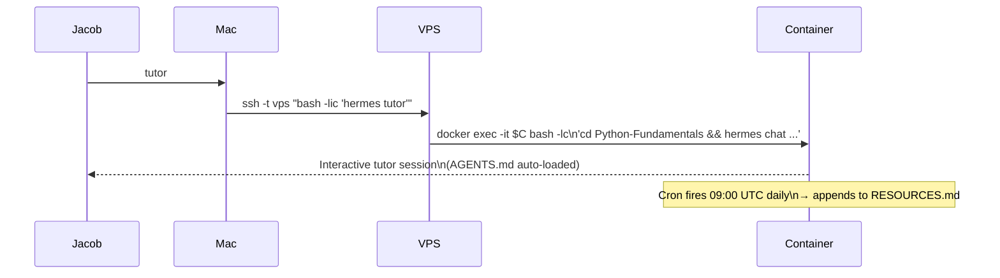
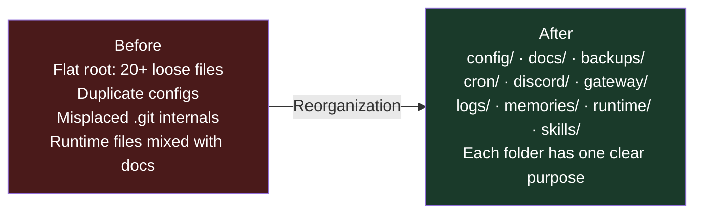
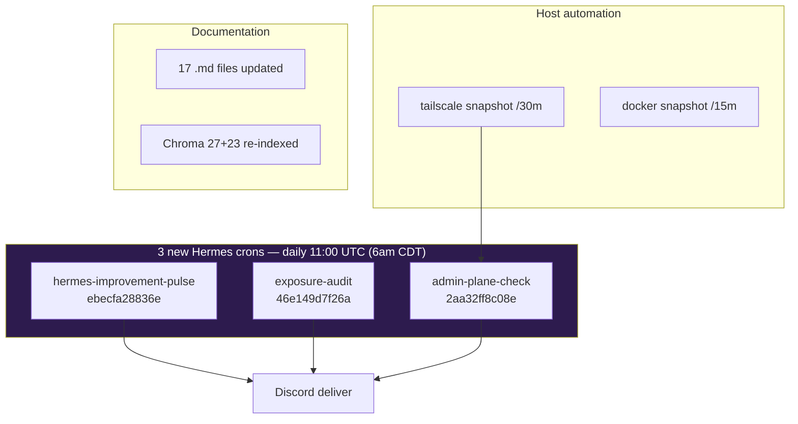
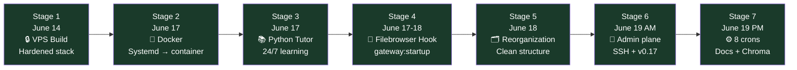

# Hermes Build Retrospective

**Project:** `VPS_Hermes_Project`  

**Last Updated:** June 19, 2026

A running history of what was planned, what was actually built, and how the system evolved. Updated each time a major milestone is reached.

---

## Stage 1: Initial VPS Build (June 14, 2026)

### Original Plan vs. Reality

| Area | Original Plan | What Was Built | Delta |
|------|--------------|----------------|-------|
| Hermes location | VPS primary | VPS primary | ✅ Matched |
| Main interface | Gateway CLI + Discord | Hermes Desktop app (SSH tunnel) + Discord | Bigger than planned |
| Connection method | Gateway + possible SSH | SSH tunnel + Tailscale + persistent LaunchAgent | More advanced |
| Services | Basic gateway | Two user services: gateway + dashboard | +1 service |
| Authentication | Basic | Session token in EnvironmentFile | More secure |
| Root processes | Plan to remove | Root Telegram gateway fully removed | ✅ Completed |
| Security hardening | UFW + key-only SSH | UFW + Hostinger firewall + fail2ban + AllowUsers | Exceeded scope |
| Mac integration | Deferred | Implemented via SSH tunnel + Desktop app | Done early |
| Documentation | Basic architecture doc | 6+ markdown files (README, SECURITY, SETUP, etc.) | 6× more |
| Firewall layers | 1 (UFW) | 2 (Hostinger + UFW) | +100% |
| Backup strategy | Not scoped | Dual-layer: encrypted secrets + git config backup | Added |

### Stage 1 Verdict: ✅ Exceeded — production-ready, hardened beyond original scope

---

## Stage 2: Docker Migration (June 17, 2026)

### What Changed

The entire Hermes install was migrated from a manual systemd-based setup to the **Hostinger Docker catalog container**.

| Before (Deleted) | After (Current) |
|-----------------|-----------------|
| `~/.hermes/` manual install | `ghcr.io/hostinger/hvps-hermes-agent:latest` |
| `hermes-gateway.service` (systemd) | Container entrypoint (PID 1) |
| `hermes-dashboard.service` (systemd) | Container entrypoint (PID 12) |
| Dashboard on `127.0.0.1:9119` | Traefik reverse proxy → `:4860` |
| SSH tunnel LaunchAgent (Mac) | Tailscale MagicDNS (no tunnel needed) |
| `~/.local/bin/hermes` (VPS) | `docker exec $C hermes` (via `~/.bashrc` wrapper) |
| SSH `AllowUsers jacob` + port 9119 tunnel | SSH port 2222 Tailscale-only |

### Key Decisions Made

1. **Hostinger Docker catalog** chosen over manual install — automatic restarts, image-based updates, Traefik pre-wired
2. **HERMES_HOME=/opt/data** — persistent bind mount, survives container recreates
3. **Filebrowser via SSH LocalForward** — no sudo available, no raw port mapping possible; Tailscale tunnel is the cleanest solution
4. **NordVPN removed (Mac + VPS)** — running Nord broke Tailscale admin routing; Hermes egress is plain Hostinger IP (inbound still hardened — see SECURITY.md)

### Stage 2 Verdict: ✅ Complete — clean Docker setup, all services running

---

## Stage 3: Python Tutor Subsystem (June 17, 2026)



**What was built:**
- Course at `/opt/data/Projects/Python-Fundamentals/` (15 lessons, exercises, progress tracking)
- `AGENTS.md` instructor brief — auto-loaded when `hermes tutor` sets cwd
- Daily cron: `Python Course Material Scan` at 09:00 UTC — appends beginner resources to `RESOURCES.md`
- Mac `tutor()` alias — one command from Mac to reach the tutor in the container
- VPS `hermes tutor` wrapper — routes through `~/.bashrc` into the container

### Stage 3 Verdict: ✅ Complete — 24/7 tutor always available, daily resource scan running

---

## Stage 4: Filebrowser Hook (June 17–18, 2026)

**Problem:** Filebrowser started manually and died on every container restart. No persistent way to restart it without sudo.

**Solution:** Hermes `gateway:startup` event hook system.

```
/opt/data/hooks/start-filebrowser/
├── HOOK.yaml      ← triggers on gateway:startup
└── handler.py     ← pgrep check → Popen filebrowser on :4861
```

**Access:** Host `socat` relay on `127.0.0.1:4861` → Mac `LocalForward 4861 127.0.0.1:4861` via `ssh -fN vps-filebrowser` → `localhost:4861`.

### Stage 4 Verdict: ✅ Complete — filebrowser auto-starts on every container restart

---

## Stage 5: File Structure Reorganization (June 18, 2026)

**Problem:** `/opt/data/Projects/VPS_Hermes_Project/` was a flat mess of docs, config files, runtime state, git artifacts, and backups all mixed together.

**What was done:**



**Specific changes:**
- Created `docs/` → moved all `.md` files and guides
- Created `config/` → moved `config.yaml`, `.env`, `auth.json`, `channel_directory.json`
- Created `runtime/` → moved `.bash_history`, `.hermes_history`, cache files
- Merged `vps-config/` into `docs/` → deleted `vps-config/`
- Moved `.git/.gitignore` → repo root (where it belongs)
- Moved `.git/.gitconfig` → `/opt/data/.gitconfig`
- Deleted `hermes-wrapper` (useless one-liner: `exec hermes "$@"`)
- Deleted `.git/hermes_github` (Mac terminal history, irrelevant)
- Fixed all ownership issues (`chown -R 10000:10000 .git/`)

### Stage 5 Verdict: ✅ Complete — clean, efficient, maintainable structure

---

## Stage 6: Admin Plane Hardening & Doc Pass (June 19, 2026)

**Problems addressed:**
- Mac SSH failed with `Could not resolve hostname vps-hermes-project` (Tailscale DNS off)
- NordVPN on Mac broke Tailscale → SSH timeouts
- Hostinger catalog apps evaluated (n8n, 9router, Ackee) without silent installs
- Hermes v0.17.0 released upstream while container stayed on v0.16.0

**What was done:**

| Item | Outcome |
|------|---------|
| Mac `~/.ssh/config` | `HostName <VPS_TAILSCALE_IP>` + `id_ed25519_finder` |
| `known_hosts` | Updated VPS host key for `[<VPS_TAILSCALE_IP>]:2222` |
| Tailscale Mac settings | Documented — DNS off, subnets on |
| Nord on Mac | Reinstalled — policy: disconnect for VPS work |
| SECURITY.md | Mac admin plane + planned Tailscale-only UI binding |
| n8n | Deployed via Hostinger (`n8n-eywu-n8n-1`) |
| 9router / Ackee | Documented — not deployed |
| Hermes v0.17.0 | Upgrade path documented; live still v0.16.0 |
| Timezones | Mac CDT vs VPS UTC documented |
| INDEX.md | Fixed line-number corruption in git backup |

### Stage 6 Verdict: ✅ Complete — admin access documented and stabilized; optional apps awaiting Jacob approval

---

## Stage 7: Productive Crons & Full Doc Pass (June 19, 2026 — evening)

**Problems addressed:**
- Stack had monitoring but no daily self-improvement or exposure auditing
- Documentation lagged live stack (5 crons, MagicDNS URLs, missing n8n)
- Chroma index stale after doc edits

**What was done:**



| Item | Outcome |
|------|---------|
| `hermes-improvement-pulse` | Version, MCP probes, Chroma/git drift → one action for Jacob |
| `exposure-audit` | Audits `0.0.0.0` Docker binds → Discord on alert |
| `admin-plane-check` | Tailscale snapshot + Nord policy → Discord on alert |
| Schedule | All 3 at **`0 11 * * *`** = **6:00 AM CDT** daily |
| Host crontab | `tailscale status` → snapshot every 30m |
| `stack_status.sh` | Netdata IP `<VPS_TAILSCALE_IP>`, n8n URL line |
| Docs | Full pass with mermaid viz — INDEX, Workflow, APPLICATIONS, etc. |
| Chroma | `vps_knowledge=27`, `python_lessons=23` (27 = chunks from 17 .md files) |
| Git commits | `2128a26` (crons) · `b2c81fa` (6am schedule) · `ceeb996` (doc pass) |

**Total Hermes crons: 8** (5 original + 3 new). `cron/jobs.json` backed up in git.

### Stage 7 Verdict: ✅ Complete — stack now self-improves, self-audits, and docs match live reality

---

## Deployment Timeline (All Milestones)



| Date | Milestone | Status |
|------|-----------|--------|
| June 14, 2026 | VPS hardened: UFW + Hostinger firewall + fail2ban | ✅ |
| June 14, 2026 | SSH secured: key-only, port 2222, AllowUsers jacob | ✅ |
| June 14, 2026 | Hermes Desktop app updated to v0.16.0 | ✅ |
| June 14, 2026 | Root Telegram gateway removed | ✅ |
| June 14, 2026 | Encrypted offline backup of secrets (Mac) | ✅ |
| June 16, 2026 | Automated git config backup deployed | ✅ |
| June 17, 2026 | Migrated from systemd to Docker container | ✅ |
| June 17, 2026 | Exa configured as web search backend | ✅ |
| June 17, 2026 | NordVPN removed (Mac; VPS never attached) — Tailscale stability | ✅ |
| June 19, 2026 | Egress/VPN audit documented in SECURITY.md | ✅ |
| June 17, 2026 | Python tutor subsystem fully operational | ✅ |
| June 17, 2026 | Filebrowser gateway:startup hook deployed | ✅ |
| June 18, 2026 | VPS_Hermes_Project/ reorganized into clean subfolders | ✅ |
| June 18, 2026 | All .md documentation rewritten with diagrams | ✅ |
| June 18, 2026 | `fallback_providers` configured (deepseek → anthropic → gemini) | ✅ |
| June 19, 2026 | Netdata — Tailscale :19999, Discord alerts | ✅ |
| June 19, 2026 | Egress/VPN audit + Mac SSH IP fix documented | ✅ |
| June 19, 2026 | n8n deployed (`n8n-eywu-n8n-1`, `:32771`) | ✅ |
| June 19, 2026 | 9router, Ackee evaluated — not deployed | ✅ |
| June 19, 2026 | Hermes v0.17.0 release — upgrade path documented | 🟡 Pending upgrade |
| June 19, 2026 | 3 productive crons — improvement, exposure, admin-plane | ✅ |
| June 19, 2026 | Crons daily 11:00 UTC (6:00 AM CDT) | ✅ |
| June 19, 2026 | Chroma re-index 27+23; full doc pass with viz | ✅ |

---

## What's Still Open

| Item | Priority | Notes |
|------|----------|-------|
| Upgrade Hermes to v0.17.0 | High | `hermes update -y` or Hostinger image refresh |
| Tailscale-only Docker binds | Medium | Beszel, Uptime Kuma, Hermes dashboard |
| MCP agentmemory + chroma `failed` | Medium | Fix npx/uvx permissions in container |
| Harden n8n host bind to Tailscale IP | Medium | Currently `0.0.0.0:32771` |
| Deploy 9router / Ackee | Low | Jacob approves per APP_INSTALL_POLICY |
| Push docs to GitHub | Low | When Jacob says "push docs" |
| Nord split-tunnel for Tailscale | Low | Optional — disconnect is reliable default |

---

*Last Updated: June 19, 2026 (final pass — Stage 7)*

---

*Last audited: June 19, 2026 (final pass)* — see [INDEX.md](INDEX.md) for navigation.
