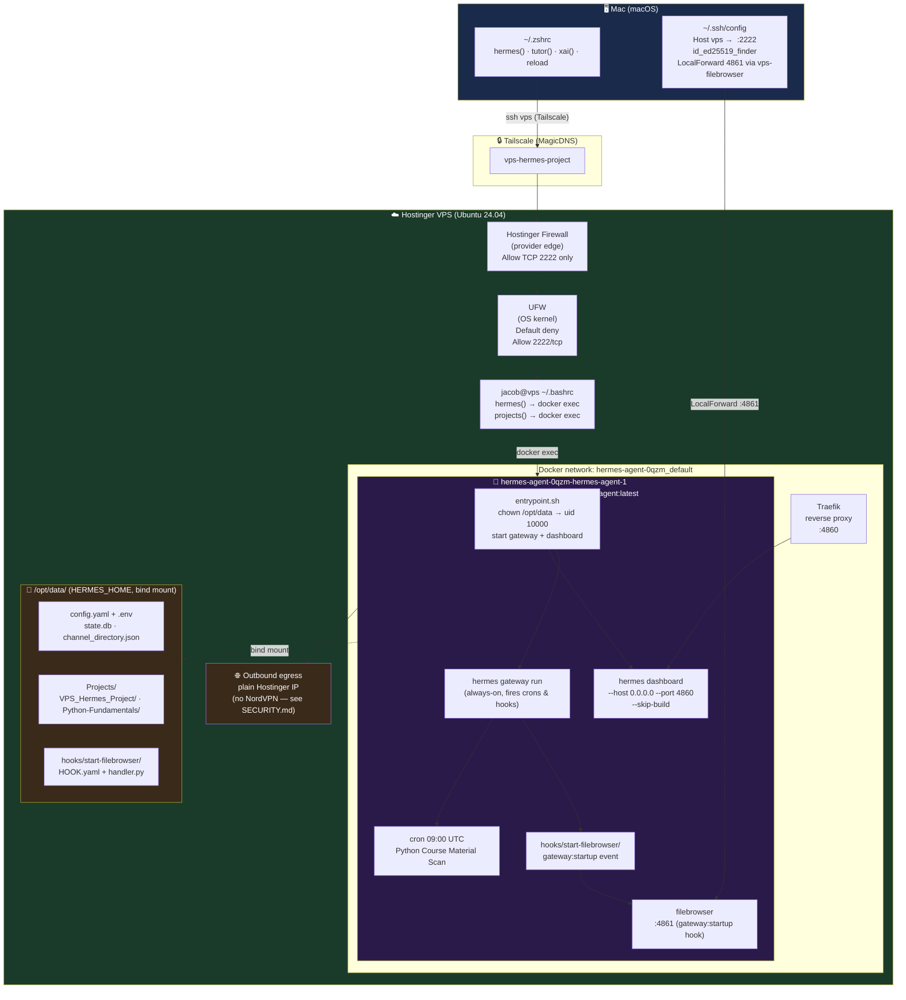
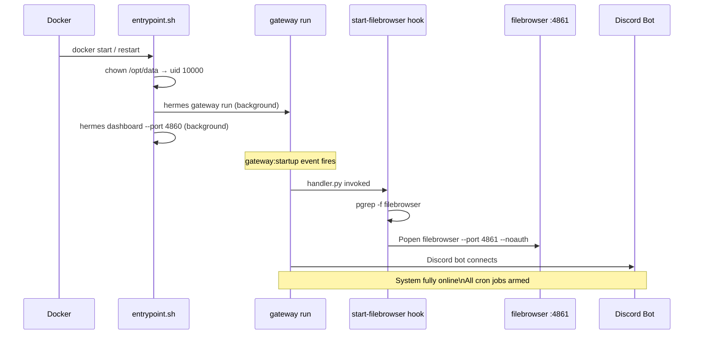
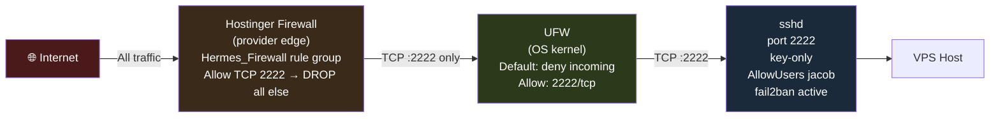

# Hermes VPS Setup Guide

**Author:** Jacob Cowan
**Version:** 5.0 (Docker Container — Current)
**Last Updated:** June 20, 2026 (v0.17.0 live, port corrections, desktop gateway)

> **This document reflects the live Docker-based setup.** All references to `hermes-dashboard.service`, `hermes-gateway.service`, `~/.hermes/`, port 9119, and SSH tunnel LaunchAgents describe the deleted manual systemd install.

---

## Full Stack Diagram



> **VPN note:** `nordvpn-gateway` was planned early in the project but **never attached** to Hermes. NordVPN on Mac and VPS is **off** because it broke Tailscale. Admin = Tailscale; agent egress = VPS public IP. See [SECURITY.md](SECURITY.md#egress--vpn-posture-live-june-19-2026).

---

## Container Details

| Item | Value |
|------|-------|
| Image | `ghcr.io/hostinger/hvps-hermes-agent:latest` |
| Version (live) | **v0.17.0** (in-container upgrade 2026-06-20; image still 0.16.0) |
| Hostinger image | `ghcr.io/hostinger/hvps-hermes-agent:latest` (still ships 0.16.0 as of 2026-06-20) |
| Compose project | `hermes-agent-0qzm` |
| Container name | `hermes-agent-0qzm-hermes-agent-1` *(resolve dynamically — suffix may change)* |
| HERMES_HOME | `/opt/data` inside container |
| Container user | uid 10000 (`hermes`) |
| Host bind mount | `/docker/hermes-agent-0qzm/data` (root-owned on host) |
| Container IPs | Dynamic per Docker network (e.g. `172.16.2.2`, `172.16.3.3`) — do not hardcode |
| Dashboard | Traefik → `:4860` (host port **32787** → 4860; port changes on each container recreate) |
| Filebrowser | `:4861` in container → host `socat` relay on `127.0.0.1:4861` → Mac via `ssh -fN vps-filebrowser` |
| Git backup | `github.com/jacobcowanr/VPS_Hermes_Project` (main branch) |

**Always resolve container name dynamically:**
```bash
C=$(docker ps --filter ancestor=ghcr.io/hostinger/hvps-hermes-agent:latest --format '{{.Names}}' | head -1)
```

---

## Startup Sequence

Every time the container starts, this sequence fires automatically:



---

## Access Methods

### SSH (Mac → VPS)
```bash
ssh vps                          # Resolves via HostName <VPS_TAILSCALE_IP> in ~/.ssh/config
ssh -p 2222 jacob@<VPS_TAILSCALE_IP> # Same — explicit IP
```

**Prerequisites:** Tailscale healthy on Mac (not `offline`). **Disconnect NordVPN** if SSH times out.

**DNS:** Mac Tailscale **Use DNS = OFF** — `vps-hermes-project` does not resolve without Tailscale DNS. IP-based `HostName` is intentional.

SSH reaches the VPS over Tailscale. Emergency fallback: Hostinger hPanel → VPS → Terminal.

### Timezone

| Location | Zone |
|----------|------|
| VPS host | **UTC** (all cron, logs, API cap resets) |
| Jacob's Mac | `America/Chicago` (CDT, UTC−5 summer) |

Python tutor cron `09:00 UTC` = **4:00 AM CDT**.


### Desktop App — Remote Gateway

Connect the Hermes desktop Mac app directly to this VPS instance:

1. Hermes Desktop → **Settings → Gateway → Remote gateway**
2. Remote URL: `http://<VPS_TAILSCALE_IP>:32787`
3. **Sign in** with `HERMES_DASHBOARD_BASIC_AUTH_USERNAME` / `PASSWORD` from `/opt/data/.env`

The host port (`32787`) is assigned by Hostinger on container creation — it changes on force-recreate. Check live port with:
```bash
docker ps --format "{{.Names}}	{{.Ports}}" | grep hermes-agent
```

**Troubleshooting:**
- "Session expired" after container restart → Settings → Gateway → Sign in (URL is saved)
- "Could not reach gateway" → verify port hasn't changed due to recreate
- Blank app / liveness failure → version mismatch; run `docker exec hermes-agent-0qzm-hermes-agent-1 hermes --version` and ensure it matches desktop (`v0.17.0`)

### Container Shell
```bash
C=$(docker ps --filter ancestor=ghcr.io/hostinger/hvps-hermes-agent:latest --format '{{.Names}}' | head -1)
docker exec -it "$C" bash        # Full shell as root
docker exec -u 10000 -it "$C" bash  # Shell as hermes user
```

### Dashboard
- Hostinger Docker Manager → your container → "Open"
- Or Traefik-routed URL on port 4860
- Basic auth: `HERMES_DASHBOARD_BASIC_AUTH_USERNAME/PASSWORD` in `/opt/data/.env`

### Filebrowser (`:4861`)
```bash
# On Mac — open SSH tunnel in background
ssh -fN vps

# Then open in browser
open http://localhost:4861
```
Filebrowser auto-starts on every container restart via the `gateway:startup` hook in `/opt/data/hooks/start-filebrowser/`.

---

## File Structure

Two layers. Hermes reads flat paths at `/opt/data/` root — the `Projects/VPS_Hermes_Project/` subfolder is the git backup only.

```
── LIVE: /opt/data/  (HERMES_HOME — what Hermes reads) ──────────────────────
├── config.yaml              ← LIVE config (read by entrypoint on every start)
├── .env                     ← LIVE secrets (never committed)
├── SOUL.md                  ← LIVE agent identity (read by Hermes)
├── auth.json                ← credential pool fingerprints
├── channel_directory.json   ← Discord channel map
├── state.db / kanban.db     ← databases (do not edit while gateway runs)
├── gateway.pid / gateway.lock / gateway_state.json  ← runtime state
├── hooks/
│   └── start-filebrowser/   ← gateway:startup hook (LIVE, not in git subfolder)
├── bin/                     ← manual ops scripts (stack_status.sh, chroma_bootstrap.py)
├── scripts/                 ← cron runtime scripts (synced from .hermes/scripts/)
├── .hermes/scripts/         ← cron source — edit here, then sync
├── embeddings/              ← HuggingFace cache for Chroma MCP (~88 MB)
├── cron/                    ← job definitions and per-job output/
│   └── output/<job-id>/     ← timestamped cron run artifacts
├── logs/                    ← gateway.log, agent.log, errors.log
├── sessions/                ← conversation history
├── memories/                ← long-term memory
├── skills/                  ← installed skill packages
├── state-snapshots/         ← point-in-time recovery bundles (gitignored)
│
└── Projects/
    ├── Python-Fundamentals/ ← Python tutor course (canonical copy)
    │
    └── VPS_Hermes_Project/  ← GIT BACKUP REPO (docs + config copies)
        ├── .git/            ← github.com/jacobcowanr/VPS_Hermes_Project
        ├── .gitignore
        ├── config/
        │   ├── config.yaml  ← BACKUP copy of /opt/data/config.yaml
        │   ├── auth.json    ← BACKUP copy (fingerprints only, no raw keys)
        │   └── channel_directory.json
        ├── docs/            ← all .md documentation
        ├── hooks/           ← BACKUP copy of /opt/data/hooks/
        ├── cron/            ← BACKUP copy of /opt/data/cron/
        └── backups/         ← gitignored (excluded — may contain keys)
```


> **VPS host `/opt/data/` (outside Hermes container):** Supporting apps keep dedicated folders — `chroma/` (vector persistence), `agentmemory/` (org + exports), `beszel/agent/` (Beszel agent). Project and git folder: `VPS_Hermes_Project`.

> **Rule:** After editing `/opt/data/config.yaml` (live), copy it to `Projects/VPS_Hermes_Project/config/config.yaml` before committing. After a restore, copy the other direction: `config/config.yaml` → `/opt/data/config.yaml`.

---

## Entrypoint & Auto-Start

`/entrypoint.sh` runs on every container start. If `/opt/data/config.yaml` exists it:
1. `chown`s `/opt/data` to uid 10000 (`hermes`)
2. Starts `hermes gateway run` (background — fires hooks, crons, Discord)
3. Starts `hermes dashboard --host 0.0.0.0 --port 4860 --no-open --skip-build`
4. `gateway:startup` event fires → `hooks/start-filebrowser/handler.py` → filebrowser starts on `:4861`

**Verify after any container restart:**
```bash
docker exec "$C" hermes gateway status
docker exec "$C" hermes cron list
docker exec "$C" pgrep -f filebrowser && echo "filebrowser running"
```

---

## Model & Provider Configuration

| Role | Provider | Model | Notes |
|------|----------|-------|-------|
| **Primary** | DeepSeek | `deepseek-v4-flash` | Default; pool credits |
| Fallback 1 | OpenRouter | `google/gemini-2.5-flash-lite` | $1/day cap, resets UTC midnight |
| Fallback 2 | Anthropic | `claude-haiku-4-5-20251001` | Prepaid credits |
| Fallback 3 | Google direct | `gemini-2.5-flash-lite` | Free-tier quotas |

**Web search:** Exa (`web.search_backend: exa` in config.yaml, `EXA_API_KEY` in `.env`)

All provider API keys live in `/opt/data/.env`. Config is at `/opt/data/config.yaml`.

---

## Netdata (host Docker)

Deployed **on VPS host** (not inside Hermes container). Hermes probes via Docker DNS `http://netdata:19999`.

| Item | Value |
|------|-------|
| Container | `netdata` (`netdata/netdata:latest`) |
| Network | `hermes-agent-0qzm_default` (shared with Hermes) |
| Tailscale UI | `http://<VPS_TAILSCALE_IP>:19999` (bound to Tailscale IP only — MagicDNS off on Mac) |
| Volumes | `netdata-config`, `netdata-lib`, `netdata-cache` |
| Alerts | Discord `#netdata` — `health_alarm_notify.conf` + `health.d/vps-hermes-project.conf` |
| docker.sock | Read-only on Netdata only |

**Do not** add TCP 19999 to Hostinger public firewall — Tailscale-only access.

---

## Firewall & Security



| Layer | Control | Status |
|-------|---------|--------|
| Hostinger Network Firewall | Provider-edge, `Hermes_Firewall` | Active — allow TCP 2222, drop all else |
| UFW | OS kernel firewall | Active — default deny incoming, allow 2222/tcp |
| SSH | Key-only, port 2222, `AllowUsers jacob` | Active |
| fail2ban | Port 2222, ban after 3 attempts / 1h window | Active |
| Tailscale | Admin overlay — SSH, Netdata, SFTP from Mac | Active |
| Dashboard | Traefik + basic auth | Active |
| Container | Runs as uid 10000, non-root | Active |
| Secrets | `.env` mode 600, excluded from git | Active |
| Auto-updates | unattended-upgrades | Active |
| Malware | Monarx agent (Hostinger pre-installed) | Active |

---

## Backup & Recovery

```bash
C=$(docker ps --filter ancestor=ghcr.io/hostinger/hvps-hermes-agent:latest --format '{{.Names}}' | head -1)

# Commit current /opt/data state to GitHub
docker exec -u 10000 "$C" sh -c 'cd /opt/data/Projects/VPS_Hermes_Project && git add -A && git commit -m "backup: $(date +%Y-%m-%d)" && git push origin main'

# Restore after container wipe (config.yaml only — .env must be re-entered manually)
# cp direction: backup (config/config.yaml) → live (/opt/data/config.yaml)
docker exec -u 10000 "$C" sh -c 'cd /opt/data/Projects/VPS_Hermes_Project && git pull origin main && cp config/config.yaml /opt/data/config.yaml'
```

**Never committed:** `/opt/data/.env` — excluded via `.gitignore`. If lost, must be reconstructed manually from stored keys.

---

## Updating Hermes

Update = pull a newer image via the **Hostinger Docker Manager** and recreate the container. `/opt/data` is preserved via the bind mount.

1. Hostinger hPanel → Docker Manager → Pull latest image
2. Recreate container
3. Verify: `docker exec "$C" hermes gateway status`

**Do NOT run `hermes update` inside the container** — modifies `/opt/hermes` which resets on next image pull.

---

## Version & Upgrade

| Field | Value |
|-------|-------|
| **Live** | v0.17.0 (in-container upgrade; image base = 0.16.0) |
| **Upstream** | [v0.17.0 — v2026.6.19](https://github.com/NousResearch/hermes-agent/releases/tag/v2026.6.19) ("The Reach Release") |

### v0.17.0 highlights (VPS-relevant)

| Feature | Why it matters here |
|---------|---------------------|
| **Memory batch operations** | Atomic add/replace/remove — fewer failed memory edits |
| **Background subagents** | `delegate_task(background=true)` — long jobs without blocking chat |
| **Curator cost fix** | LLM consolidation off by default — zero aux tokens on routine runs |
| **Dashboard auth hardening** | Safer if `:4860` is exposed |
| **Automation Blueprints** | Schedule jobs without cron syntax |
| **`search_files` densification** | Lower token burn on file search |

### Upgrade procedure

```bash
# On VPS (after ssh vps)
hermes update -y
hermes --version    # target: v0.17.0

# If venv ownership errors (seen June 19):
docker exec -u root "$C" chown -R hermes:hermes /opt/hermes/.venv
hermes update -y

# Or: Hostinger Docker Manager → update Hermes app image → restart container
```

Back up `/opt/data/config.yaml`, `SOUL.md`, and `memories/` before upgrading. Re-run `chroma_bootstrap.py` after doc changes.

**⚠ In-container upgrade caveat:** `docker compose up --force-recreate` resets `/opt/hermes` to the image version (0.16.0). To survive a recreate at 0.17.0:
```bash
# After any force-recreate, re-apply the in-container upgrade:
docker exec -u root hermes-agent-0qzm-hermes-agent-1 \
  /opt/hermes/.venv/bin/pip install --force-reinstall hermes-agent==0.17.0
docker exec -u root hermes-agent-0qzm-hermes-agent-1 \
  chown -R hermes:hermes /opt/hermes/.venv
# Chroma reindex deps are ALSO wiped by recreate — chroma_reindex.sh cron needs them:
docker exec -u 10000 -e HOME=/opt/data hermes-agent-0qzm-hermes-agent-1 \
  uv pip install --python /opt/hermes/.venv/bin/python3 chromadb sentence-transformers
docker restart hermes-agent-0qzm-hermes-agent-1
```
Permanent fix: wait for Hostinger to publish a 0.17.0 image.

> **Reindex note:** `scripts/chroma_reindex.sh` (and its `.hermes/scripts/` copy) connect to Chroma via `CHROMA_HOST=chroma` (the container was renamed from `distracted_dirac` — old refs were corrected 2026-06-20). To reindex one collection only (avoids wiping the other): `CHROMA_COLLECTION=vps_knowledge`. The script deletes+recreates a collection, so a blind full run with an empty `Python-Fundamentals/` glob would empty `python_lessons`.

---

## Troubleshooting

| Symptom | Cause | Fix |
|---------|-------|-----|
| SSH timeout from Mac | NordVPN connected or Tailscale `offline` | Disconnect Nord; `tailscale status`; retry `ssh vps` |
| `Could not resolve hostname vps-hermes-project` | Old SSH config used MagicDNS | Use `HostName <VPS_TAILSCALE_IP>` in `~/.ssh/config` (see Aliases.md) |
| nano opens on Hermes start | Accidental **Cmd/Ctrl+G** | Ctrl+X, N — external editor hotkey, not a crash |
| Tailscale not connected | Nord or coordination server | Disconnect Nord; wait for Mac to leave `offline` |
| `hermes` on VPS host does nothing | Dead stub at `~/.local/bin/hermes` | Use `docker exec $C hermes …` instead |
| Dashboard blank / 502 | Container not running or Traefik issue | `docker ps`, then Hostinger Docker Manager |
| 401 errors on API calls | `.env` missing or malformed | `docker exec $C hermes config show` |
| Cron not firing | Gateway down | `docker exec $C hermes gateway status` |
| Filebrowser not accessible | SSH tunnel not open | `ssh -fN vps` then `open http://localhost:4861` |
| Filebrowser login prompt | Old auth DB | `docker exec $C rm -rf /opt/data/.filebrowser/filebrowser.db` and restart filebrowser |
| `git push` permission denied | `.git-credentials` missing or wrong owner | Check `/opt/data/.git-credentials` is owned by uid 10000 |

---

## Useful Commands

```bash
C=$(docker ps --filter ancestor=ghcr.io/hostinger/hvps-hermes-agent:latest --format '{{.Names}}' | head -1)

# Health checks
docker exec "$C" hermes gateway status    # gateway health
docker exec "$C" hermes cron list         # cron jobs
docker exec "$C" hermes config show       # full config
docker exec "$C" hermes status            # overall health

# Logs
docker logs "$C" --tail 50               # container stdout
docker exec "$C" tail -50 /opt/data/logs/gateway.log

# Process checks
docker exec "$C" pgrep -af hermes
docker exec "$C" pgrep -af filebrowser

# Container management
docker restart "$C"                       # full restart (gateway + filebrowser auto-start)
docker ps                                 # confirm running
```

---

*Last Updated: June 20, 2026 (v0.17.0 live, port corrections, desktop gateway added)*

---

*Last audited: June 20, 2026* — see [INDEX.md](INDEX.md) for navigation.
