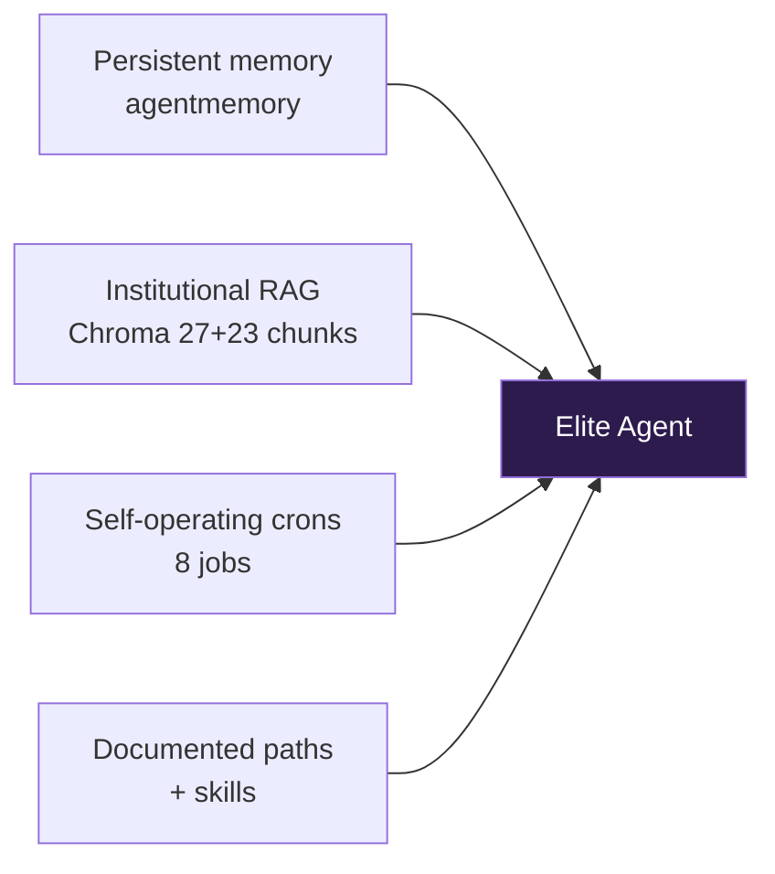
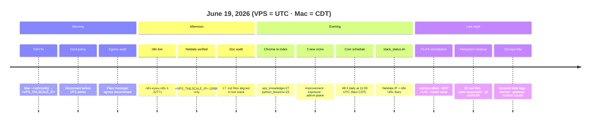
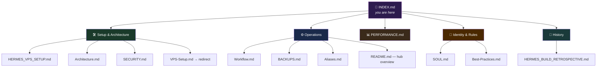
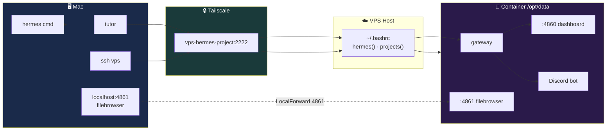
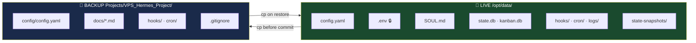
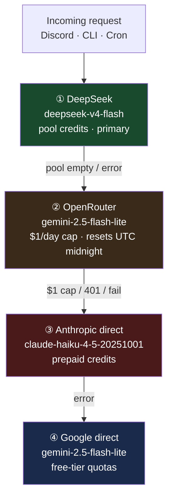
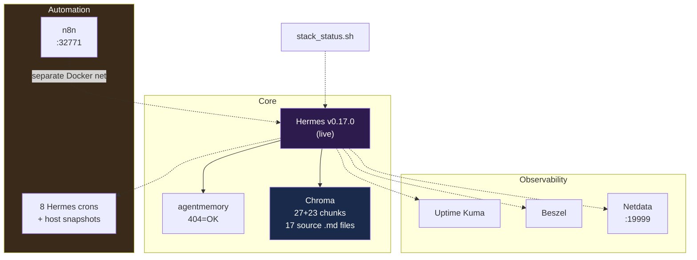
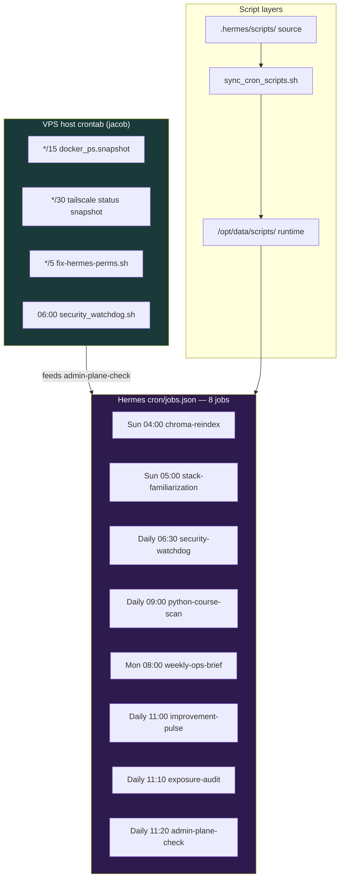
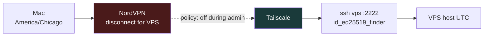

# Hermes Master Index

**Author:** Jacob Cowan  
**Repository:** [jacobcowanr/VPS_Hermes_Project](https://github.com/jacobcowanr/VPS_Hermes_Project) (private)  
**Live home:** `/opt/data/` · **Git backup:** `/opt/data/Projects/VPS_Hermes_Project/`  
**Last Updated:** June 20, 2026 (v0.17.0 live, provider order fix, port corrections, desktop gateway)
**Project:** `VPS_Hermes_Project` (git repo, docs, and filesystem folder)

> **Start here** when you need to find anything — docs, paths, commands, or who owns what layer.

---


---

## Why This Hermes Stands Out



| vs typical AI | Jacob's Hermes |
|---------------|----------------|
| Forgets each session | agentmemory persists facts |
| Hallucinates setup | Chroma cites indexed docs |
| Manual health checks | stack_status + Uptime Kuma + Beszel + Netdata |
| "Run docker ps for me" | Operates via canonical paths + snapshot |

Full narrative: [README.md](README.md) · Per-app depth: [APPLICATIONS.md](APPLICATIONS.md)

---

## June 19, 2026 — Day Timeline

Everything shipped or documented on this day, in order.



| Time (UTC) | Event | Git / ops |
|------------|-------|-----------|
| Morning | Mac SSH `Could not resolve hostname` fixed | `HostName <VPS_TAILSCALE_IP>` in `~/.ssh/config` |
| Morning | Nord + Tailscale coexistence documented | [SECURITY.md](SECURITY.md) Mac Admin Plane |
| Afternoon | n8n deployed via Hostinger catalog | `n8n-eywu-n8n-1` · `:32771` |
| Afternoon | 9router, Ackee evaluated — not installed | APP_INSTALL_POLICY.md |
| Afternoon | Hermes v0.17.0 upgraded live (in-container) | In-container upgrade; force-recreate reverts — see [HERMES_VPS_SETUP.md](HERMES_VPS_SETUP.md) |
| Evening | Full doc pass (17 files) + Chroma re-index | Commits `ceeb996` … `b2c81fa` |
| Evening | 3 productive crons added | `ebecfa28836e`, `46e149d7f26a`, `2aa32ff8c08e` |
| Evening | New crons scheduled daily **11:00 UTC** = **6:00 AM CDT** | `cron/jobs.json` |
| Late night | P1–P4 remediation: 8 orphan TUI sessions, MCP `+x` root cause, model → `deepseek/deepseek-v4-flash` | [PERFORMANCE.md](PERFORMANCE.md) |
| Late night | `/opt/data/` root cleaned — 23 mandatory files + folders only | `state-snapshots/` · commit `d1e9158` |
| Late night | Git repo deduped — removed stale `logs/`, `discord/`, `gateway/`, `runtime/` under `Projects/` | Live state stays at `/opt/data/` root |

---

## Navigation Map



---

## Find by Task

| I want to… | Read this |
|------------|-----------|
| Understand the full system design | [Architecture.md](Architecture.md) |
| Set up or recover the VPS container | [HERMES_VPS_SETUP.md](HERMES_VPS_SETUP.md) |
| Run daily commands / pick a tier | [Workflow.md](Workflow.md) |
| Back up or restore config | [BACKUPS.md](BACKUPS.md) |
| Check costs, speed, resource usage | [PERFORMANCE.md](PERFORMANCE.md) |
| Supporting apps (agentmemory, Chroma, Beszel) | [APPLICATIONS.md](APPLICATIONS.md) |
| Dev tools & Python packages | [DEVELOPMENT.md](DEVELOPMENT.md) |
| Review security posture / egress / VPN | [SECURITY.md](SECURITY.md) (Egress & VPN Posture section) |
| Harden admin UIs (Tailscale-only ports) | [SECURITY.md](SECURITY.md) (Planned Hardening section) |
| Upgrade Hermes to v0.17.0 | [HERMES_VPS_SETUP.md](HERMES_VPS_SETUP.md) (Version & Upgrade) |
| Evaluate new Hostinger catalog apps | [APPLICATIONS.md](APPLICATIONS.md) (Candidate Applications) |
| Install new apps / services | APP_INSTALL_POLICY.md |
| **Full reconfigure Hermes (Discord)** | HERMES_FULL_CONFIGURE_PROMPT.md |
| See shell shortcuts (Mac + VPS) | Aliases.md |
| Understand agent personality & rules | SOUL.md |
| Prompting & tier-selection philosophy | [Best-Practices.md](Best-Practices.md) |
| See how we got here (build timeline) | [HERMES_BUILD_RETROSPECTIVE.md](HERMES_BUILD_RETROSPECTIVE.md) |
| Quick hub + config snapshot | [README.md](README.md) |

---

## Access Matrix



| Surface | How to reach | Auth |
|---------|--------------|------|
| **Discord** | Always-on via gateway | Bot token in `/opt/data/.env` |
| **Dashboard** | Tailscale → Traefik `:4860` (host `:32787`) | Basic auth in `.env` |
| **Filebrowser** | `ssh -fN vps` then `http://localhost:4861` | Container credentials |
| **Netdata** | Tailscale → `http://<VPS_TAILSCALE_IP>:19999` | Mac app or Chrome "Install as App" |
| **SSH shell** | `ssh vps` → `<VPS_TAILSCALE_IP>:2222` | `id_ed25519_finder` (see Aliases.md) |
| **Hermes CLI** | Mac local or `ssh vps` → `hermes cmd` | API keys in respective `.env` |
| **Desktop app** | Settings → Gateway → Remote gateway → `http://<VPS_TAILSCALE_IP>:32787` | Dashboard basic auth |
| **Git backup** | Inside container at `Projects/VPS_Hermes_Project/` | `.git-credentials` (not committed) |

> **SSH note:** Mac `~/.ssh/config` uses `HostName <VPS_TAILSCALE_IP>` because **Use Tailscale DNS = OFF**. MagicDNS names like `vps-hermes-project` do not resolve on the Mac without Tailscale DNS enabled.

---

## Timezones

| Location | Zone | Notes |
|----------|------|-------|
| **Jacob's Mac** | `America/Chicago` (CDT, UTC−5 in summer) | Wall-clock for daily work |
| **VPS host** | **UTC** | All `date` output, cron schedules, OpenRouter daily cap reset |

**Rule of thumb:** When it's **3:00 PM** in Chicago, the VPS clock reads **8:00 PM UTC**. Schedule Hermes crons and future n8n flows in UTC, or convert before editing `cron/jobs.json`.

---

## Two-Layer File Model

Hermes reads **flat** paths at `/opt/data/`. The git repo is a **backup mirror** — never the live source of truth.



### Path Reference

| Asset | Live (Hermes reads) | Git backup | Committed? |
|-------|---------------------|------------|------------|
| Main config | `/opt/data/config.yaml` | `config/config.yaml` | ✅ |
| Secrets | `/opt/data/.env` | — | 🚫 never |
| Agent identity | `/opt/data/SOUL.md` | `docs/SOUL.md` | ✅ |
| Auth fingerprints | `/opt/data/auth.json` | `config/auth.json` | ✅ |
| Discord channels | `/opt/data/channel_directory.json` | `config/channel_directory.json` | ✅ |
| Cron jobs | `/opt/data/cron/jobs.json` | `cron/jobs.json` | ✅ |
| Startup hooks | `/opt/data/hooks/` | `hooks/` | ✅ |
| Recovery bundles | `/opt/data/state-snapshots/` | — | 🚫 gitignored |
| Runtime state | `gateway.pid`, `state.db`, caches | — | 🚫 gitignored |
| Bundled skills | `/opt/data/skills/` | `skills/` | 🚫 gitignored |

---

## Documentation Catalog

| File | Lines* | Audience | Summary |
|------|--------|----------|---------|
| [README.md](README.md) | ~200 | Everyone | Hub overview, two-layer model, config snapshot |
| [INDEX.md](INDEX.md) | — | Everyone | **This file** — master navigation |
| [PERFORMANCE.md](PERFORMANCE.md) | — | Ops / cost tuning | Resources, provider economics, tuning |
| [Architecture.md](Architecture.md) | ~400 | Design | Dual-tier, provider chain, subsystems |
| [HERMES_VPS_SETUP.md](HERMES_VPS_SETUP.md) | ~350 | Deploy / recover | Docker, Traefik, firewall, file tree |
| [Workflow.md](Workflow.md) | ~300 | Daily use | Tier selection, commands, routines |
| [BACKUPS.md](BACKUPS.md) | ~200 | Ops | Commit/push, restore, what gets tracked |
| [SECURITY.md](SECURITY.md) | ~250 | Security review | Firewall, secrets model, open risks |
| Aliases.md | ~150 | Shell users | Mac `~/.zshrc` + VPS `~/.bashrc` shortcuts |
| [Best-Practices.md](Best-Practices.md) | ~200 | Prompting | Tier framework, project rules |
| SOUL.md | 150 | Agent context | Identity, collaboration style |
| [HERMES_BUILD_RETROSPECTIVE.md](HERMES_BUILD_RETROSPECTIVE.md) | ~300 | History | Plan vs reality, milestones |
| [DEVELOPMENT.md](DEVELOPMENT.md) | — | Dev | Python/Node tooling, venv packages |
| VPS-Setup.md | ~20 | Redirect | Points to HERMES_VPS_SETUP.md |

*\*Approximate — run `wc -l docs/*.md` for live counts.*

---

## Provider Stack (Current)



> DeepSeek is primary. OpenRouter is fallback #1 ($1/day cap). When DeepSeek pool runs low, fund or rotate — see [PERFORMANCE.md](PERFORMANCE.md).

---

## Command Cheat Sheet

```bash
# ── Mac ──────────────────────────────────────────
hermes "prompt"              # local CLI
tutor                        # Python course via VPS
ssh vps                      # Tailscale shell
ssh -fN vps                  # background tunnel → filebrowser :4861

# ── VPS host ─────────────────────────────────────
hermes gateway status        # routes to container
hermes chat                  # interactive session
projects                     # ls /opt/data/Projects

# ── Inside container ─────────────────────────────
C=$(docker ps -qf "ancestor=ghcr.io/hostinger/hvps-hermes-agent:latest" | head -1)
docker exec -u hermes -it $C bash
cd /opt/data
hermes gateway restart
hermes cron list

# ── Git backup ───────────────────────────────────
cd /opt/data/Projects/VPS_Hermes_Project
git status && git log -3 --oneline
```

---

## Repo Layout (Git Backup Only)

```
Projects/VPS_Hermes_Project/
├── docs/           ← all .md documentation (this folder)
├── config/         ← backup copies of live config files
├── hooks/          ← startup hook source
├── cron/           ← job definitions
├── backups/        ← timestamped snapshots (gitignored)
├── gateway/        ← legacy nested state (not live path)
├── discord/        ← thread state (gitignored at runtime)
├── logs/           ← log copies (gitignored)
├── memories/       ← USER.md gitignored
├── runtime/        ← history files (gitignored)
└── skills/         ← bundled library (gitignored)
```

---

## Maintenance Checklist

| Frequency | Action | Doc |
|-----------|--------|-----|
| Daily | `hermes gateway status` | [Workflow.md](Workflow.md) |
| After config edit | `cp` live → backup, commit, push | [BACKUPS.md](BACKUPS.md) |
| Weekly | Review [PERFORMANCE.md](PERFORMANCE.md) usage | [PERFORMANCE.md](PERFORMANCE.md) |
| After key rotation | Update `/opt/data/.env`, restart gateway | [SECURITY.md](SECURITY.md) |
| Before wipe/restore | Snapshot to `state-snapshots/` | [BACKUPS.md](BACKUPS.md) |

---

*See also: [README.md](README.md) · [PERFORMANCE.md](PERFORMANCE.md) · [HERMES_VPS_SETUP.md](HERMES_VPS_SETUP.md)*

---


---

## Live Ops Stack



## Cron & Snapshot Automation



> **6:00 AM CDT block:** `hermes-improvement-pulse`, `exposure-audit`, and `admin-plane-check` all fire at **11:00 UTC** daily. See [Workflow.md](Workflow.md) for the full gantt.

## Admin Plane (Mac → VPS)



| Check | Command |
|-------|---------|
| Stack health | `/opt/data/bin/stack_status.sh` |
| Paths reference | `skills/vps-ops/references/paths-and-endpoints.md` |
| Re-index docs | `/opt/hermes/.venv/bin/python3 /opt/data/bin/chroma_bootstrap.py` |
| Sync cron scripts | `/opt/data/.hermes/scripts/sync_cron_scripts.sh` |

## Canonical Paths

```
HERMES_HOME=/opt/data
Docs:     /opt/data/Projects/VPS_Hermes_Project/docs/
Config:   /opt/data/config.yaml, /opt/data/.env
Skills:   /opt/data/skills/
Cron:     /opt/data/cron/jobs.json
Ops bin:  /opt/data/bin/              # manual: stack_status.sh, chroma_bootstrap.py
Cron src: /opt/data/.hermes/scripts/  # edit → sync_cron_scripts.sh
Cron run: /opt/data/scripts/          # scheduler script: names
Snapshot: /opt/data/docker_ps.snapshot
Ref:      /opt/data/skills/vps-ops/references/paths-and-endpoints.md
Course:   /opt/data/Projects/Python-Fundamentals/
```

**Endpoints (internal Docker DNS):**

| Service | URL | Healthy |
|---------|-----|---------|
| agentmemory | `http://agentmemory-o72l-agentmemory-1:3111/` | HTTP 404 |
| Chroma | `http://chroma:8000/api/v2/heartbeat` | HTTP 200 |
| Beszel | `http://beszel:8090/api/health` | HTTP 200 |
| Uptime Kuma | `http://uptime-kuma-fl0m-uptime-kuma-1:3001/` | HTTP 302 |
| Netdata | `http://netdata:19999/api/v1/info` (internal) · `http://<VPS_TAILSCALE_IP>:19999` (Mac via Tailscale) | HTTP 200 |
| n8n | `http://n8n-eywu-n8n-1:5678/` (not on Hermes network) · `http://<VPS_TAILSCALE_IP>:32771` (Mac) | Hostinger public URL also live |

---

## Hermes Version

| Field | Value |
|-------|-------|
| **Live (container)** | v0.17.0 (in-container upgrade 2026-06-20; Hostinger image = 0.16.0) |
| **Upstream target** | [v0.17.0 (v2026.6.19)](https://github.com/NousResearch/hermes-agent/releases/tag/v2026.6.19) |
| **Upgrade** | `hermes update -y` inside container, or Hostinger image refresh — see [HERMES_VPS_SETUP.md](HERMES_VPS_SETUP.md) |

---

*Last Updated: June 20, 2026 (v0.17.0 live, port/provider corrections, desktop gateway)*
