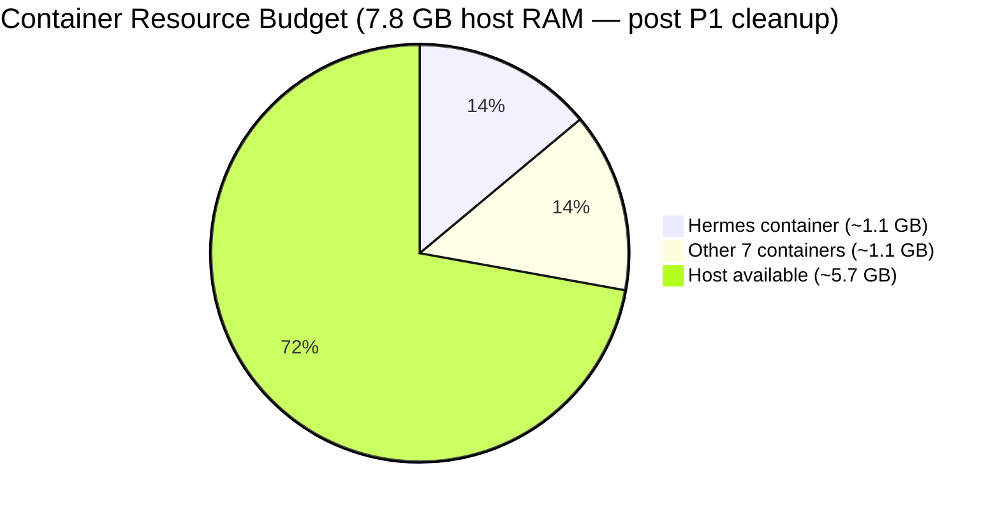
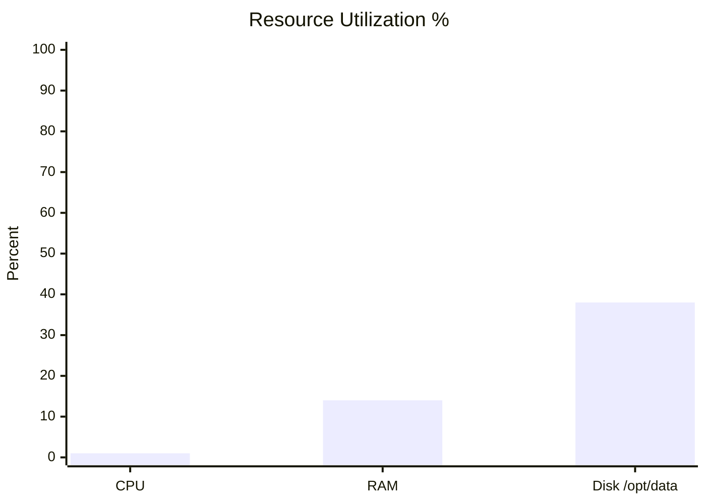
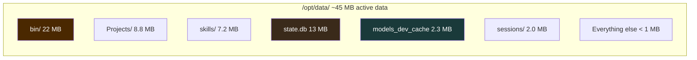
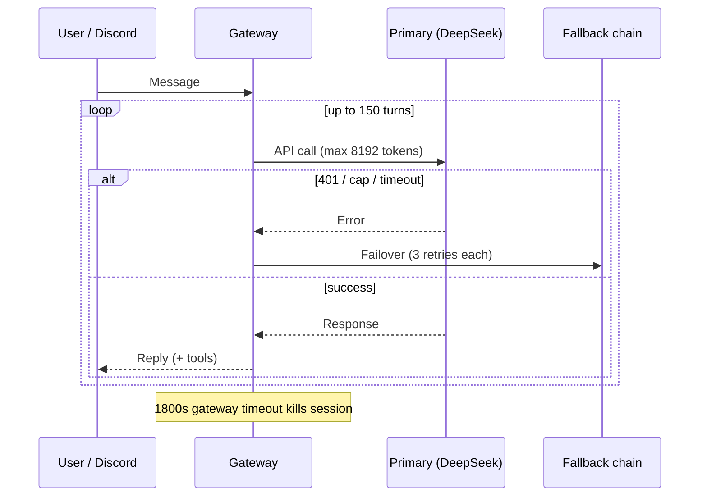
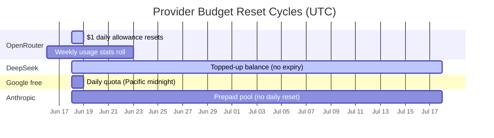
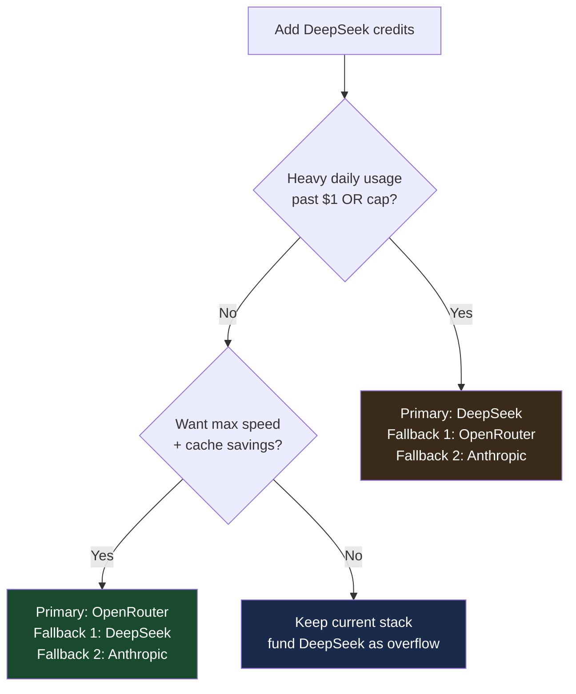
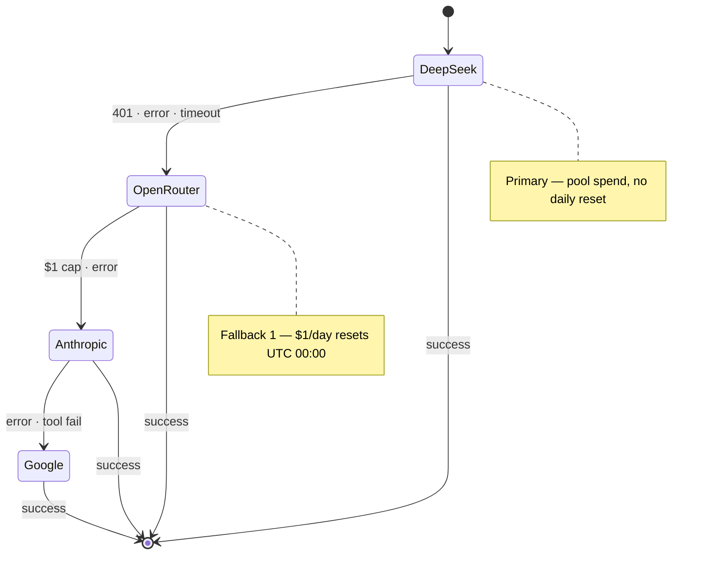
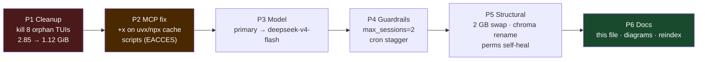

# Hermes Performance & Economics

**Project:** `VPS_Hermes_Project`  

**Author:** Jacob Cowan  
**Scope:** VPS container (`hermes-agent-0qzm`) — live `/opt/data/`  
**Last Updated:** June 19, 2026 (post-remediation — P1–P6)
**Snapshot time:** 2026-06-19 ~22:40 UTC (after orphan cleanup + model swap)

> Resource usage, provider cost model, failover behavior, and tuning levers. Pair with [INDEX.md](INDEX.md) for navigation and [Workflow.md](Workflow.md) for daily ops.

---

## Executive Summary



| Signal | Status | Notes |
|--------|--------|-------|
| Gateway | 🟢 Running | Discord connected — runs manually via `hermes gateway restart` (PID changes per restart; not a systemd service) |
| Container RAM | 🟢 ~14.5% host | **~1.12 GiB** used (was 2.85 GiB pre-orphan cleanup) |
| Container CPU | 🟢 Low | Idle baseline |
| Disk `/opt/data` | 🟢 38% | 36 GB used / 96 GB |
| `state.db` | 🟡 13 MB | Grows with sessions — monitor monthly |
| Primary model | 🟢 DeepSeek | `deepseek/deepseek-v4-flash` (was flash-lite OR) |
| Host swap | 🟢 Active | **2 GB** swapfile on + in `/etc/fstab` (persistent) |
| `max_concurrent_sessions` | 🟢 Capped | **2** (was null) |

---

## Live Infrastructure Snapshot

### Host & Container

| Metric | Value |
|--------|-------|
| VPS OS | Ubuntu 24.04 (kernel 6.8.0-124) |
| Container OS | Debian 13 (trixie) |
| Container image | `ghcr.io/hostinger/hvps-hermes-agent:latest` v0.16.0 → [v0.17.0 target](https://github.com/NousResearch/hermes-agent/releases/tag/v2026.6.19) |
| CPUs visible | 2 |
| Host RAM | 7.8 GiB (~5.7 GiB available post-cleanup) |
| Swap | **2 GB** swapfile — active + persistent in `/etc/fstab` |
| Chroma container | `chroma` (stable name; was `distracted_dirac`) |
| Network I/O | ~5.5 MB in / 7.7 MB out (since start) |

### Container Resource Usage



| Resource | Used | Limit | % |
|----------|------|-------|---|
| CPU | ~1.2% | 2 cores | Low |
| Memory | **1.12 GiB** | 7.755 GiB | **14.5%** |
| Disk (bind mount) | 36 GB | 96 GB | 38% |

---

## Storage Breakdown

### Top Consumers (`/opt/data/`)



| Path | Size | Type | Action if large |
|------|------|------|-----------------|
| `bin/` | 22 MB | Hermes binaries | Normal — do not delete |
| `Projects/` | 8.8 MB | Git repos + course | Normal |
| `skills/` | 7.2 MB | Bundled skill packages | Gitignored; Hermes-managed |
| `state.db` | 13 MB | Agent state SQLite | Vacuum if > 50 MB |
| `models_dev_cache.json` | 2.3 MB | Model catalog cache | Safe to delete; regenerates |
| `sessions/` | 2.0 MB | Conversation history | Archive old sessions |
| `kanban.db` | 112 KB | Task board | Normal |
| `logs/` | 80 KB | Runtime logs | Rotate if > 10 MB |
| `provider_models_cache.json` | 6 KB | Provider cache | Normal |
| `config.yaml` | 12 KB | Live config | Normal |

### Databases

| File | Size | WAL/SHM | Safe to touch? |
|------|------|---------|----------------|
| `state.db` | 13 MB | shm varies | ❌ while gateway runs |
| `kanban.db` | 112 KB | — | ❌ while gateway runs |

---

## Agent Performance Settings

From live `/opt/data/config.yaml`:

| Setting | Value | Effect |
|---------|-------|--------|
| `max_tokens` | 8192 | Max output per API call |
| `max_turns` (agent) | 150 | Hard ceiling on tool+reply loops |
| `gateway_timeout` | 1800 s (30 min) | Kill hung sessions |
| `gateway_timeout_warning` | 900 s (15 min) | Warn before timeout |
| `api_max_retries` | 3 | Retries per provider call |
| `max_concurrent_sessions` | **2** | Caps orphan TUI leak (was null) |
| `cron.max_parallel_jobs` | **2** | Limits 11:00 UTC cron pileup |
| Cron ticker | 60 s | Background job poll interval |
| Kanban dispatcher | 60 s | Task board poll interval |



---

## Provider Economics

### Stack Order (Live)

| # | Provider | Model | Role today |
|---|----------|-------|------------|
| Primary | **DeepSeek direct** | `deepseek-v4-flash` | **Live** — fast, cache-friendly (key rotated 2026-06-19) |
| Fallback 1 | **OpenRouter** | `google/gemini-2.5-flash-lite` | Affordability-first cheap backup |
| Fallback 2 | Anthropic direct | `claude-haiku-4-5-20251001` | Quality fallback |
| Fallback 3 | Google direct (Gemini) | `gemini-2.5-flash-lite` | Last resort |

### Cost Comparison (Typical Agent Turn)

| Provider | ~Cost/msg | Speed | Cache benefit | Billing model |
|----------|-----------|-------|---------------|---------------|
| **OpenRouter** + Gemini 2.5 Flash Lite | ~$0.003 | Fast | Low | **$1/day hard cap** · resets **UTC midnight** |
| **DeepSeek** direct | ~$0.003 | Very fast | **High** (repeated system prompts) | **Pool until $0** · no daily reset |
| **Anthropic** Haiku | ~$0.005 | Fast | Medium | Prepaid credits · no daily reset |
| **Google** direct free tier | $0* | Fast | N/A | Daily quota · resets **midnight Pacific** |
| DeepSeek via OpenRouter | ~$0.005+ | Fast | Low | Avoid — markup over direct |

*\*Free tier subject to quota; paid tier billed per token.*

### Reset Periods — Decision Matrix



| Provider | Spend resets? | Rate limits | Best for |
|----------|---------------|-------------|----------|
| **OpenRouter** | **Yes — $1/day UTC midnight** | Per-key daily cap | Fallback #1 cheap model |
| **DeepSeek** | **No — pool until depleted** | Concurrency 429s | Burst overflow, cache-heavy agents |
| **Anthropic** | No — prepaid balance | Tier-based RPM | Quality fallback |
| **Google direct** | Daily + per-minute quotas | Free tier limits | Emergency fallback only |

### Recommended Promotion Path (When DeepSeek Funded)



---

## Failover Behavior



**Non-retryable errors (abort immediately):** HTTP 401 authentication failures after key validation.

**Retryable:** Timeouts, 429 rate limits, 5xx — up to 3 attempts per provider.

---

## Network & Access Performance

| Path | Latency factor | Notes |
|------|----------------|-------|
| Mac → VPS (Tailscale) | ~20–80 ms | Via `<VPS_TAILSCALE_IP>` — MagicDNS off on Mac |
| VPS → OpenRouter API | ~100–300 ms | US endpoints |
| VPS → DeepSeek API | ~150–400 ms | China-origin; still fast for flash models |
| VPS → Anthropic API | ~100–250 ms | US |
| Dashboard (Traefik :4860) | Tailscale only | No SSH tunnel needed |
| Filebrowser (:4861) | SSH LocalForward | `ssh -fN vps` required |

---

## Monitoring Commands

```bash
C=$(docker ps -qf "ancestor=ghcr.io/hostinger/hvps-hermes-agent:latest" | head -1)

# Container resources (live)
docker stats $C --no-stream

# Disk
docker exec $C df -h /opt/data

# Top storage consumers
docker exec $C du -sh /opt/data/* | sort -hr | head -15

# Gateway health
docker exec -u hermes $C bash -c 'cd /opt/data && hermes gateway status'

# Recent errors
docker exec $C tail -20 /opt/data/logs/errors.log

# OpenRouter daily usage (from Mac or VPS — needs OR key)
curl -s -H "Authorization: Bearer $OPENROUTER_API_KEY" \
  https://openrouter.ai/api/v1/auth/key | python3 -m json.tool
```

---

## Tuning Playbook

### When OpenRouter cap hits mid-day

1. Gateway auto-failovers to DeepSeek (if balance > 0)
2. If DeepSeek empty → Anthropic → Google
3. **Fix:** Add DeepSeek credits or wait for UTC midnight reset
4. **Long-term:** Promote DeepSeek to primary — see promotion diagram above

### When `state.db` grows large (> 50 MB)

```bash
# Stop gateway first
hermes gateway stop
sqlite3 /opt/data/state.db "VACUUM;"
hermes gateway restart
```

### When caches bloat

```bash
# Safe to remove — regenerated on next start
rm /opt/data/models_dev_cache.json
rm /opt/data/provider_models_cache.json
hermes gateway restart
```

### When logs grow large (> 10 MB)

```bash
# Archive, don't delete blindly
tar -czf /opt/data/state-snapshots/logs-$(date +%Y%m%d).tar.gz /opt/data/logs/
truncate -s 0 /opt/data/logs/gateway.log  # only if archived
```

---

## Performance Targets

| Metric | 🟢 Healthy | 🟡 Watch | 🔴 Action |
|--------|-----------|---------|----------|
| Container RAM | < 1.5 GB | 1.5–2.5 GB | Kill orphan TUIs / check MCP leak |
| Container CPU (idle) | < 5% | 5–20% | Check runaway cron/session |
| `state.db` | < 10 MB | 10–50 MB | Plan vacuum |
| `logs/` total | < 5 MB | 5–50 MB | Rotate/archive |
| Gateway uptime | 24/7 | Restarts > 3/day | Check `errors.log` |
| API 401s | 0/hour | Any | Rotate keys in `.env` |
| OpenRouter daily | < $1 | At cap | Failover or wait for reset |

---

## Remediation Flow (2026-06-19)



**Observed latency (post-fix):** a validation web-search query returned in **20.3 s / 2 API calls** — vs a pre-fix outlier of **759 s** on the old OpenRouter/flash-lite primary. During that window the DeepSeek key briefly returned 401 and traffic auto-served from the OpenRouter fallback with **no config change** — the fallback chain working exactly as designed. Key was then rotated and the gateway restarted to reload `.env`.

---

## Historical Notes

| Date | Event | Impact |
|------|-------|--------|
| 2026-06-17 | Switched from `gemini-3.1-pro-preview` → `gemini-2.5-flash-lite` | ~10× cost reduction |
| 2026-06-18 | OpenRouter key rotated + credits added | Fixed 401 "User not found" |
| 2026-06-18 | `.env` deduped (duplicate OPENROUTER keys) | Cleaner auth resolution |
| 2026-06-18 | SOUL.md restored to flat path | Agent identity context active |
| 2026-06-18 | Fallback order: DeepSeek → Anthropic → Gemini | Cost-optimized chain |
| 2026-06-19 | P1: killed 8 orphan TUIs — RAM 2.85 → 1.12 GiB | Root leak fixed |
| 2026-06-19 | P2 root cause: MCP cache scripts lacked +x (EACCES) | Not DNS/contention |
| 2026-06-19 | P3: primary → `deepseek/deepseek-v4-flash` | Eliminates OR flash-lite timeouts |
| 2026-06-19 | P4: `max_concurrent_sessions=2`, cron stagger + `max_parallel_jobs=2` | Recurrence guard |
| 2026-06-19 | Chroma renamed `distracted_dirac` → `chroma` | Stable container name |
| 2026-06-19 | `fix-hermes-perms.sh` hardened for MCP +x | Prevents P2 regression |
| 2026-06-19 | DeepSeek key 401 → rotated to new key; gateway restarted to reload `.env` | Primary serving again |
| 2026-06-19 | Fallback chain reordered: DeepSeek → OpenRouter → Anthropic → Gemini | Affordability+performance order; removed dead duplicate rung |
| 2026-06-19 | 2 GB swapfile enabled + persisted in `/etc/fstab` | OOM guardrail (was 0 B) |
| 2026-06-19 | Latency validated: 20.3 s / 2 API calls (was 759 s pre-fix) | Confirms config under DeepSeek/fallback |

---

## MCP Performance Note

Per-session stdio MCP (`npx`/`uvx`) costs ~310 MB when interactive sessions are open. With `max_concurrent_sessions: 2`, this is bounded. Shared HTTP/SSE MCP remains an optional efficiency upgrade, not a correctness requirement after the +x fix.

---

*See also: [INDEX.md](INDEX.md) · [Architecture.md](Architecture.md) · [Workflow.md](Workflow.md) · [BACKUPS.md](BACKUPS.md)*

---

*Last audited: June 19, 2026 (post-remediation)* — see [INDEX.md](INDEX.md) for navigation.

---

## Timezone & Billing Cycles

| Event | Timezone |
|-------|----------|
| OpenRouter $1/day cap reset | **UTC midnight** |
| Hermes cron schedules | **UTC** on VPS |
| Jacob's wall clock | `America/Chicago` (CDT) |

---

## v0.17.0 Cost Notes (upcoming)

When upgraded to [v0.17.0](https://github.com/NousResearch/hermes-agent/releases/tag/v2026.6.19):

| Change | Cost impact |
|--------|-------------|
| Curator consolidation off by default | **Zero** aux-model tokens on routine curator runs |
| `search_files` densification | ~fewer input tokens per file search |
| Memory batch operations | Fewer retry turns on memory edits |

---

## Netdata — Deep Metrics

**Last documented:** June 19, 2026

| Surface | URL |
|---------|-----|
| Mac / Tailscale | `http://<VPS_TAILSCALE_IP>:19999` |
| Hermes probe | `http://netdata:19999/api/v1/info` |

Complements Beszel (host trends) and Uptime Kuma (up/down). Custom RAM/disk thresholds tuned for 8 GB Hostinger VPS. Alerts → Discord `#netdata`.
