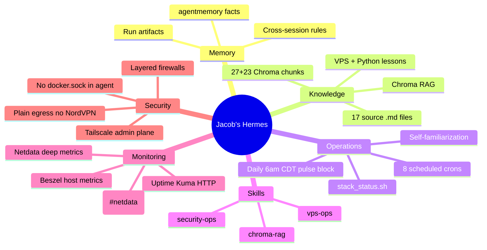
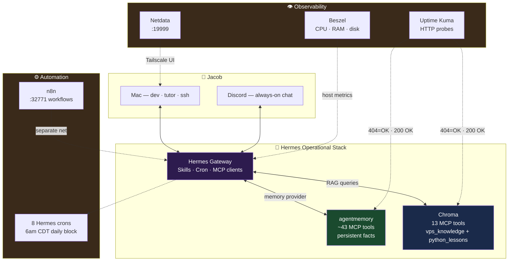
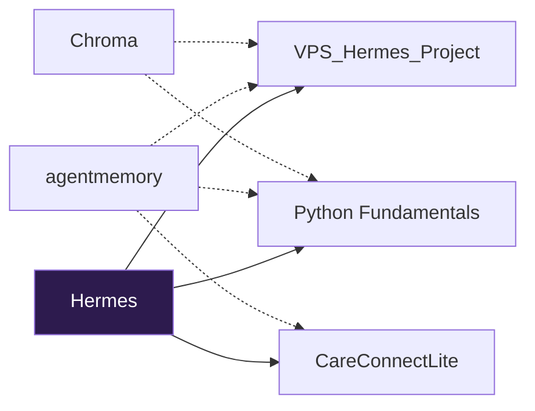
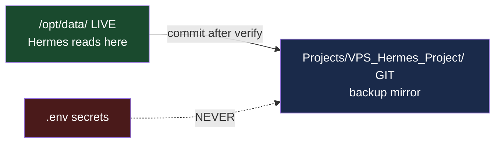

# VPS_Hermes_Project

**Author:** Jacob Cowan
**Last Updated:** June 20, 2026 (v0.17.0 live, desktop remote gateway, port corrections)
**Live home:** `/opt/data/` · **Git backup:** `/opt/data/Projects/VPS_Hermes_Project/`

> This is not a chatbot in a container. This is a **self-operating AI infrastructure** — persistent memory, institutional knowledge search, automated health checks, and documented canonical paths that let Hermes run the VPS without Jacob babysitting every command.

---

## What Makes This Hermes Stand Out

Most AI deployments are **stateless**: every session starts from zero, no memory of your projects, no awareness of your stack, no ability to verify their own health. Jacob's Hermes is different by design.



| Capability | Typical AI agent | Jacob's Hermes |
|------------|------------------|----------------|
| **Remembers you** | Forgets after session | agentmemory — facts persist across Discord, cron, CLI |
| **Knows your docs** | Hallucinates or guesses | Chroma RAG — `vps_knowledge` + `python_lessons` collections |
| **Monitors itself** | You find out when it breaks | Uptime Kuma + `stack_status.sh` + weekly briefs |
| **Runs on schedule** | Only when you prompt | 8 crons: re-index, familiarization, security, tutor, brief + improvement, exposure, admin-plane |
| **Operates the VPS** | "Please run docker ps for me" | Canonical paths, `docker_ps.snapshot`, skills — runs ops itself |
| **Stays secure** | Often over-exposed | SSH 2222 + firewalls + Tailscale admin; Nord off during VPS work — see SECURITY.md |
| **Teaches & builds** | Generic answers | Python tutor workdir + dev tooling in venv |

**The differentiator:** Hermes is an **operator**, not just a responder. It stores what it learns, searches what you've documented, checks its own health, and briefs Jacob on a schedule.

---

## System at a Glance



| Component | Status | Purpose |
|-----------|--------|---------|
| Hermes gateway | ✅ Running (v0.17.0 live(https://github.com/NousResearch/hermes-agent/releases/tag/v2026.6.19) target) | Orchestrates everything — Discord, cron, MCP, skills |
| agentmemory | ✅ 404=healthy | **Why:** Jacob never re-explains architecture every session |
| Chroma | ✅ 27+23 chunks (17 .md files) | **Why:** Hermes cites real docs, not invented setup steps |
| n8n | ✅ Running | **Why:** Deterministic workflows alongside Hermes AI automation |
| Ops crons | ✅ 8 jobs | **Why:** Stack maintains itself — re-index, brief, watchdog, improvement, exposure, admin-plane |
| Beszel + Uptime Kuma + Netdata | ✅ Live | **Why:** Catch failures and resource pressure before Jacob does |
| Path audit | ✅ Verified | **Why:** Hermes knows exactly where files and endpoints live |

---

## The Apps — Purpose in One Line Each

| App | One-line purpose | Why it makes Hermes elite |
|-----|------------------|---------------------------|
| **Hermes** | AI agent + gateway | Skills, crons, and MCP turn it into a VPS operator |
| **agentmemory** | Persistent memory store | Continuity — Hermes remembers Jacob's projects and rules |
| **Chroma** | Vector document search | Accuracy — answers grounded in indexed VPS + course docs |
| **Uptime Kuma** | HTTP uptime monitoring | Reliability — alerts before memory/RAG silently die |
| **Beszel** | Host resource dashboard | Capacity — see RAM/disk pressure on 8 GB before OOM |
| **Netdata** | Deep host + container metrics | Drill-down — per-process, I/O, Discord `#netdata` alerts |
| **n8n** | Visual workflow automation | Deterministic if-this-then-that — complements Hermes crons |
| **Filebrowser** | File UI via SSH tunnel | Access — browse `/opt/data` without exposing ports |

Deep dives: [APPLICATIONS.md](APPLICATIONS.md)

### Optional apps

| App | Status |
|-----|--------|
| **n8n** | ✅ **Deployed** June 19 — see [APPLICATIONS.md](APPLICATIONS.md#8-n8n--workflow-automation) |
| **9router** | Evaluated — not deployed |
| **Ackee** | Evaluated — not deployed |

See [APPLICATIONS.md](APPLICATIONS.md#candidate-applications-hostinger-catalog).

---

## Timezones

| Where | Zone |
|-------|------|
| Jacob's Mac | `America/Chicago` (CDT) |
| VPS | **UTC** (+5h vs Mac in summer) |

---

## Quick Start

| Task | Doc |
|------|-----|
| Full navigation | [INDEX.md](INDEX.md) |
| Desktop remote gateway | `http://<VPS_TAILSCALE_IP>:32787` → Settings → Gateway → Remote gateway |
| System design + paths | [Architecture.md](Architecture.md) |
| Every app explained | [APPLICATIONS.md](APPLICATIONS.md) |
| Daily workflow | [Workflow.md](Workflow.md) |
| Python/Node tooling | [DEVELOPMENT.md](DEVELOPMENT.md) |
| Security posture | [SECURITY.md](SECURITY.md) |

**Health check (ground truth):**
```bash
/opt/data/bin/stack_status.sh
```

---

## Projects This Stack Powers



| Project | Hermes provides |
|---------|-----------------|
| **VPS_Hermes_Project** | Self-monitoring, documented paths, weekly briefs |
| **Python Fundamentals** | Tutor workdir, `python_lessons` RAG, daily resource cron |
| **CareConnectLite** | SQLAlchemy in venv, future postgres-client on host |

---

## Two-Layer File Model



---

## Python Tutor

**Course:** `/opt/data/Projects/Python-Fundamentals/`
**Progress:** Week 1 — Lesson 3 (Working with Strings)
**Chroma:** `python_lessons` (23 docs) — Hermes retrieves lesson content, not generic Python trivia

---

*Start at [INDEX.md](INDEX.md) · Deep app docs: [APPLICATIONS.md](APPLICATIONS.md)*
