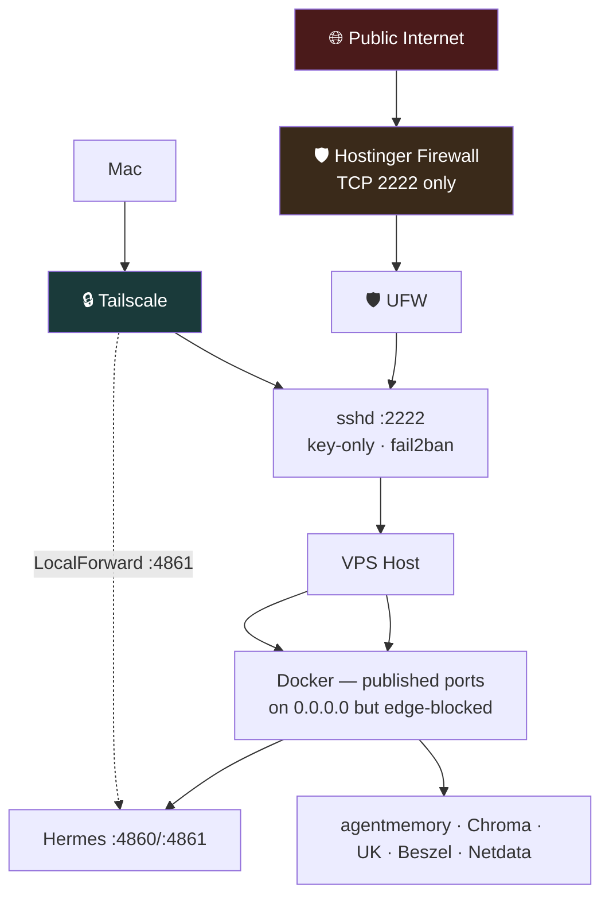
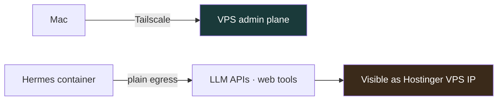
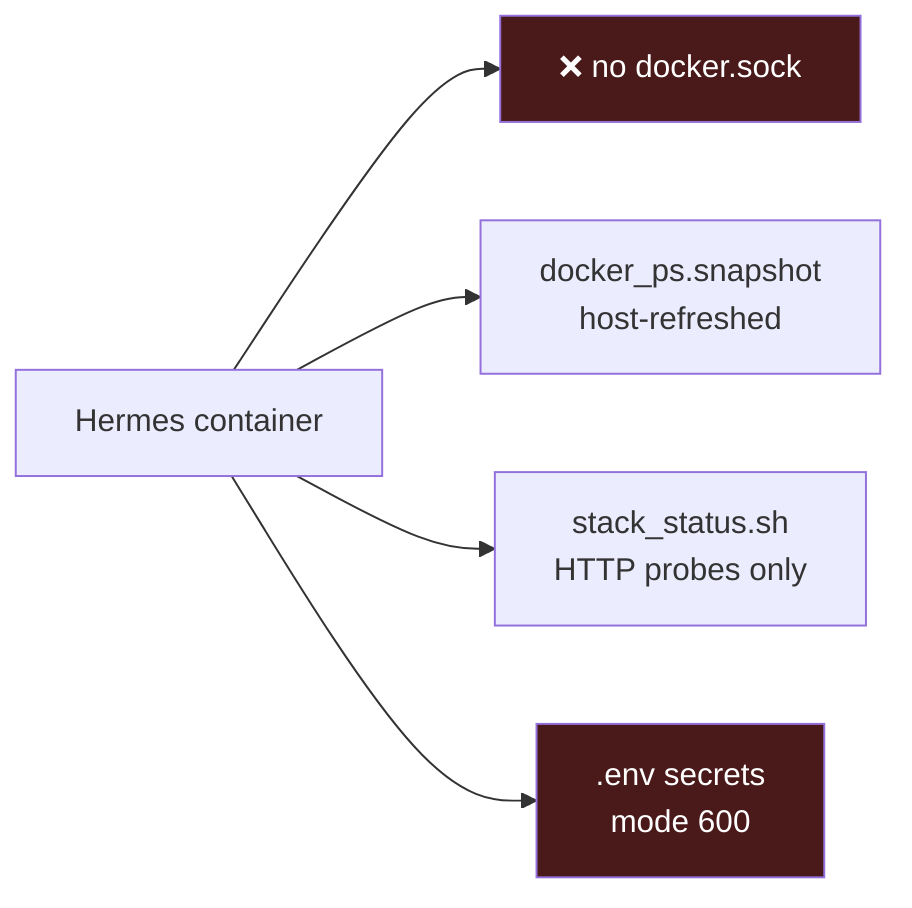
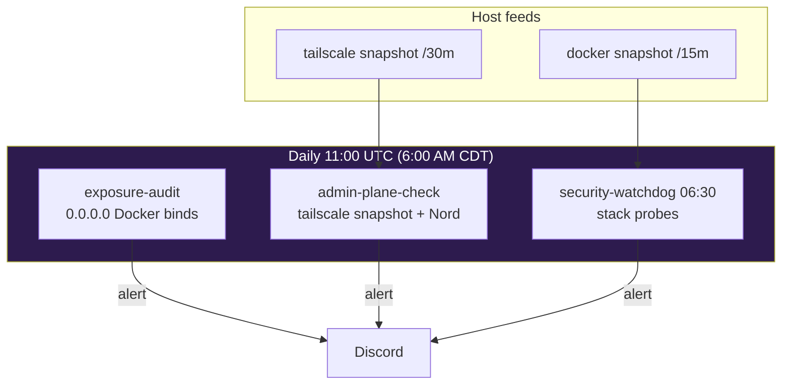

# Hermes Security Documentation

**Project:** `VPS_Hermes_Project`  

**Last Updated:** June 19, 2026 (egress/VPN audit + Mac SSH + Tailscale + planned hardening)

---

## Current Security Posture

| Layer | Control | Status |
|-------|---------|--------|
| **Hostinger Network Firewall** | Provider-edge, TCP 2222 only | ✅ Active |
| **UFW** | Default deny incoming, allow 2222/tcp | ✅ Active |
| **SSH** | Key-only, port 2222, `AllowUsers jacob` | ✅ Active |
| **fail2ban** | Port 2222, 3 attempts / 1h | ✅ Active |
| **Tailscale** | Admin overlay; Mac → VPS | ✅ Active |
| **Outbound egress VPN (NordVPN)** | Agent traffic via commercial VPN | ❌ **Not active** — removed; broke Tailscale |
| **Dashboard auth** | Traefik + basic auth | ✅ Active |
| **Container isolation** | uid 10000 (non-root) | ✅ Active |
| **Secrets isolation** | `.env` mode 600, gitignored | ✅ Active |
| **Hermes no docker.sock** | Cannot enumerate/start containers | ✅ By design |
| **Uptime Kuma** | Monitors agentmemory + Chroma | ✅ Active |
| **Beszel** | Host resource monitoring | ✅ Active |
| **Netdata** | Deep metrics + Discord `#netdata` alerts | ✅ Active (Tailscale :19999) |

---

## Network & Port Exposure



### Public (intentional)
| Port | Service | Protection |
|------|---------|------------|
| 2222/tcp | SSH | Key + fail2ban + Hostinger firewall + UFW |

### Docker published (edge-blocked)
| Port | Service | Notes |
|------|---------|-------|
| 32768+ | Hermes dashboard | Hostinger edge should block; verify hPanel |
| 32770+ | agentmemory | Internal Docker DNS preferred |
| 40307 | Uptime Kuma | Use Tailscale/SSH tunnel for UI |

### Internal only
| Port | Service | Access |
|------|---------|--------|
| 4860 | Hermes dashboard | Traefik + basic auth |
| 4861 | Filebrowser | SSH LocalForward only |
| 3111 | agentmemory | Docker network; 404=healthy |
| 8000 | Chroma | `127.0.0.1` on host; Docker DNS in stack |

---

## Egress & VPN Posture (live, June 19, 2026)

> **You are not "completely vulnerable."** Management is locked down. What you gave up is **outbound IP anonymity** for Hermes — not host hardening.

### What runs today

| Path | VPN / tunnel | Exit IP |
|------|----------------|---------|
| **Jacob → VPS** (SSH, Netdata, SFTP) | **Tailscale** overlay | N/A (encrypted admin plane) |
| **Hermes → internet** (LLM APIs, web tools, crons) | **None** | Hostinger VPS public IP |
| **NordVPN on Mac** | Reinstalled June 19 — **disconnect for VPS admin** | Breaks Tailscale when connected |
| **NordVPN on VPS / nordvpn-gateway** | Never attached to Hermes; CLI not installed | — |

### Why NordVPN was removed

Running NordVPN on the Mac (and experimenting with VPS egress VPN) **interfered with Tailscale routing** — SSH and admin access became unreliable. Jacob chose **stable admin access (Tailscale) over commercial VPN egress**.

### What is still protected (inbound / control plane)

- Layered firewalls (Hostinger edge + UFW)
- SSH key-only on non-standard port + fail2ban
- No public Filebrowser or dashboard without auth/tunnel
- Netdata bound to Tailscale IP only (`<VPS_TAILSCALE_IP>:19999`)
- Hermes container: non-root, no `docker.sock`, secrets in `.env` (mode 600)
- Monitoring: Uptime Kuma, Beszel, Netdata, Discord alerts

### What is *not* hidden (outbound / privacy)

- API calls from Hermes (OpenRouter, DeepSeek, etc.) originate from the **VPS IP**
- Cron jobs and agent web tools use the **same plain egress**
- A compromised agent could exfiltrate data **over the public internet** (not through an anonymizing VPN)

That is a **traceability / privacy** tradeoff, not an open-door on SSH or Docker admin ports.



### Future options (deferred — do not break Tailscale)

| Option | Pros | Risk |
|--------|------|------|
| **Nord split tunnel** | Hide agent egress; allow Tailscale subnets | Misconfig can lock SSH again |
| **Egress-only sidecar container** | Hermes uses `network_mode: service:nordvpn` | Complex; Hostinger catalog may not support |
| **HTTP proxy for agent only** | `tinyproxy` / similar in Docker net | Simpler than full VPN; manual wiring |
| **Tailscale-only SSH (UFW)** | Drop public :2222; SSH via TS IP only | Stronger admin lock; keep MagicDNS |

**Policy until revisited:** Tailscale wins for admin. Document plain egress honestly. Re-add VPN only with split routing tested without losing `ssh vps`.

---

## Hermes Container Security Model



---

## Git Backup Security

- `.env` **never** committed
- Private repo is not a secrets store
- Audit: `git ls-files | xargs grep -l sk-` must return empty after key rotation

See key rotation flowchart in previous version — procedure unchanged.

---

## Netdata Security Model

| Control | Detail |
|---------|--------|
| **Binding** | Published on Tailscale IP `<VPS_TAILSCALE_IP>:19999` only — not on public `0.0.0.0` |
| **Hostinger firewall** | **Do not open TCP 19999** — access via Tailscale IP `<VPS_TAILSCALE_IP>` |
| **docker.sock** | Read-only mount on `netdata` container only — Hermes has **no** docker.sock |
| **Alerts** | Discord `#netdata` via `health_alarm_notify.conf` in volume `netdata-config` |
| **Custom thresholds** | `health.d/vps-hermes-project.conf` — RAM warn 75% / crit 88%, disk `/` warn 80% / crit 90% |
| **Webhook** | Stored in `netdata-config` volume — never commit or index |

> HTTP shows "Not Secure" over Tailscale — expected; traffic stays on the overlay network.

---

## Open Risks

| Risk | Severity | Mitigation |
|------|----------|------------|
| Docker ports on 0.0.0.0 | Low | Hostinger edge firewall; verify periodically |
| SSH open to world :2222 | Low | fail2ban + keys; optional Tailscale-only UFW rule |
| **Plain egress (no VPN)** | **Medium** | APIs/crons trace to VPS IP; re-add split-tunnel VPN or proxy if privacy required |
| NordVPN + Tailscale conflict | Medium | **Disconnect Nord** before `ssh vps`; optional split-tunnel later |
| No automated backup cron | Medium | Manual git + planned Backrest |
| Mac SSH uses Tailscale IP | — | `HostName <VPS_TAILSCALE_IP>` — MagicDNS off (see below) |

---

## Mac Admin Plane (SSH + Tailscale)

### Tailscale settings (Jacob's Mac — recommended)

| Setting | Value | Why |
|---------|-------|-----|
| **Allow incoming connections** | ON | Mesh connectivity |
| **Use Tailscale DNS** | **OFF** | Avoids DNS fights with Nord; SSH uses IP in `~/.ssh/config` |
| **Use Tailscale subnets** | ON | Subnet routes if needed |
| **Launch at login** | ON | `ssh vps` works after reboot |
| **VPN On Demand** | Not enabled | Keep off |
| **Run as exit node** | OFF | Not routing others through Mac |
| **Allow local network access** | OFF | Fine unless using exit node |

### Mac `~/.ssh/config` (live)

```
Host vps vps-hermes-project vps-hermes-project.tail352af5.ts.net <VPS_TAILSCALE_IP>
    HostName <VPS_TAILSCALE_IP>
    User jacob
    Port 2222
    IdentityFile ~/.ssh/id_ed25519_finder
    IdentitiesOnly yes
    PreferredAuthentications publickey
```

**Why IP, not MagicDNS:** With Tailscale DNS disabled, `vps-hermes-project` does not resolve on macOS. Connecting via `<VPS_TAILSCALE_IP>` works regardless. Aliases `vps`, `vps-hermes-project`, etc. still match this block.

### NordVPN on Mac (June 19, 2026)

| Setting | Recommended |
|---------|-------------|
| Launch at login | OFF |
| Auto-connect | OFF |
| Kill Switch | OFF (until split-tunnel tested) |
| Stay invisible on LAN | OFF |

**Workflow:** Disconnect Nord → verify `tailscale status` (Mac not `offline`) → `ssh vps 'echo ok'`. If Nord is on and Tailscale shows `offline` or SSH times out, disconnect Nord first.

---

## Planned Hardening — Tailscale-Only Admin UIs

Several Docker services still publish on `0.0.0.0`. Hostinger edge firewall blocks most ports, but binding to the Tailscale IP is the next protection layer (same pattern as Netdata).

| Service | Current bind | Target bind |
|---------|--------------|-------------|
| **Netdata** | `<VPS_TAILSCALE_IP>:19999` | ✅ Done |
| Hermes dashboard | `0.0.0.0:32787` | `<VPS_TAILSCALE_IP>:<port>` |
| Beszel | `0.0.0.0:32769` | `<VPS_TAILSCALE_IP>:<port>` |
| agentmemory | `0.0.0.0:32770` | Docker-internal only (remove host publish) |
| Uptime Kuma | `0.0.0.0:40307` | `<VPS_TAILSCALE_IP>:<port>` |
| **n8n** | `0.0.0.0:32771` | `<VPS_TAILSCALE_IP>:32771` for admin; keep Hostinger public URL for webhooks only |

**Policy:** Admin dashboards never need public `0.0.0.0`. n8n has both Tailscale access (`:32771`) and a Hostinger public URL for webhooks — document both; tighten host bind when Jacob approves.

---

## Completed Milestones

| Date | Item |
|------|------|
| 2026-06-14 | UFW + Hostinger firewall + SSH hardening |
| 2026-06-17 | Docker container migration |
| 2026-06-18 | Filebrowser SSH tunnel only |
| 2026-06-18 | Path audit; agentmemory 404 documented as healthy |
| 2026-06-18 | docker_ps.snapshot host refresh cron |
| 2026-06-19 | Netdata deployed — Tailscale :19999, Discord `#netdata` alerts, custom RAM/disk thresholds |
| 2026-06-19 | Egress/VPN audit — plain Hostinger egress documented |
| 2026-06-19 | Mac SSH `HostName` → Tailscale IP; `known_hosts` key updated |
| 2026-06-19 | NordVPN reinstalled on Mac — policy: disconnect for VPS admin |
| 2026-06-19 | Tailscale DNS OFF documented; planned Tailscale-only UI binding |
| 2026-06-19 | n8n deployed — `n8n-eywu-n8n-1`, `:32771`, public Hostinger URL |
| 2026-06-19 | `exposure-audit` cron — daily `0.0.0.0` bind check |
| 2026-06-19 | `admin-plane-check` cron — Tailscale + Nord policy |
| 2026-06-19 | Host tailscale snapshot every 30m |

---

## Automated Security Checks



| Check | When | Script | Alerts |
|-------|------|--------|--------|
| `security-watchdog` | Daily 06:30 UTC | `security_watchdog_discord.sh` | Discord on failure |
| `exposure-audit` | Daily 11:10 UTC | `exposure_audit_discord.sh` | Discord on `0.0.0.0` exposure |
| `admin-plane-check` | Daily 11:20 UTC | `admin_plane_check.sh` | Discord on Tailscale/Nord issues |
| Host `security_watchdog.sh` | Daily 06:00 UTC | `/home/jacob/bin/security_watchdog.sh` | Host log |

---

*Last audited: June 19, 2026 (final pass — automated checks + Mac admin plane)*
*See also: [Architecture.md](Architecture.md) · Aliases.md*
