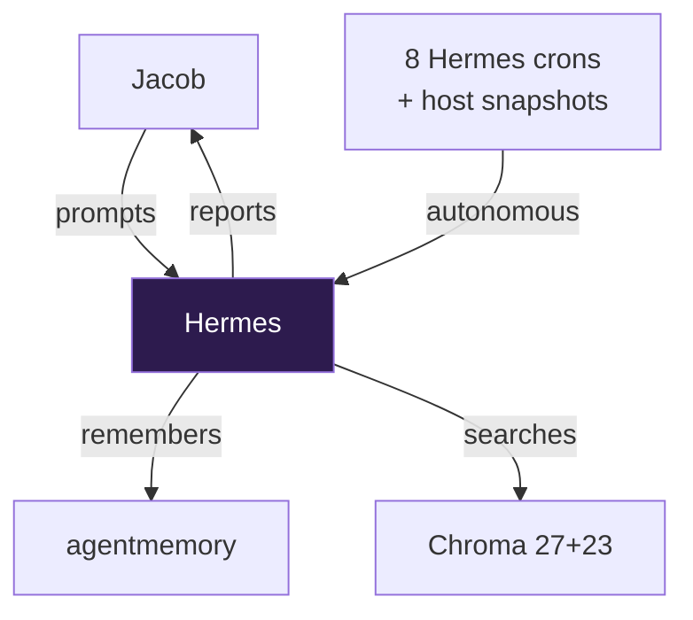
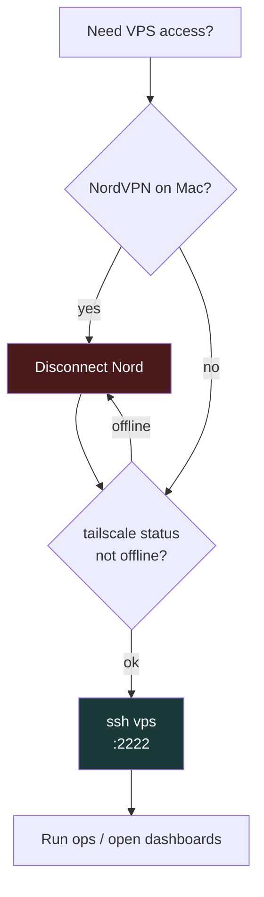
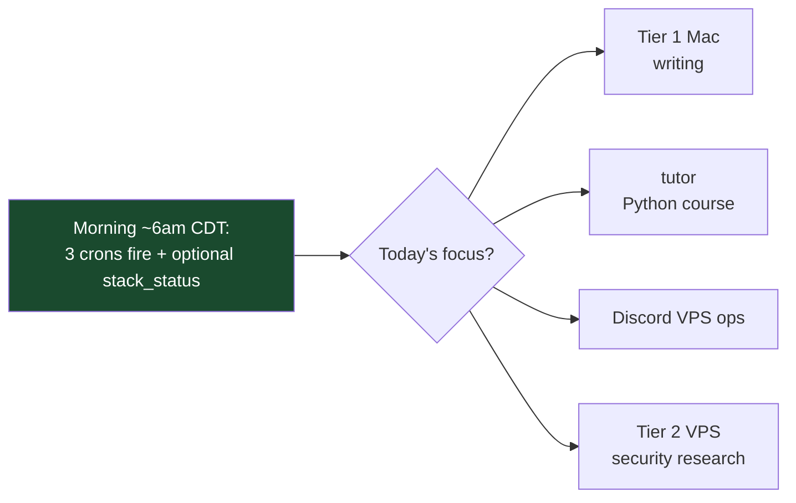
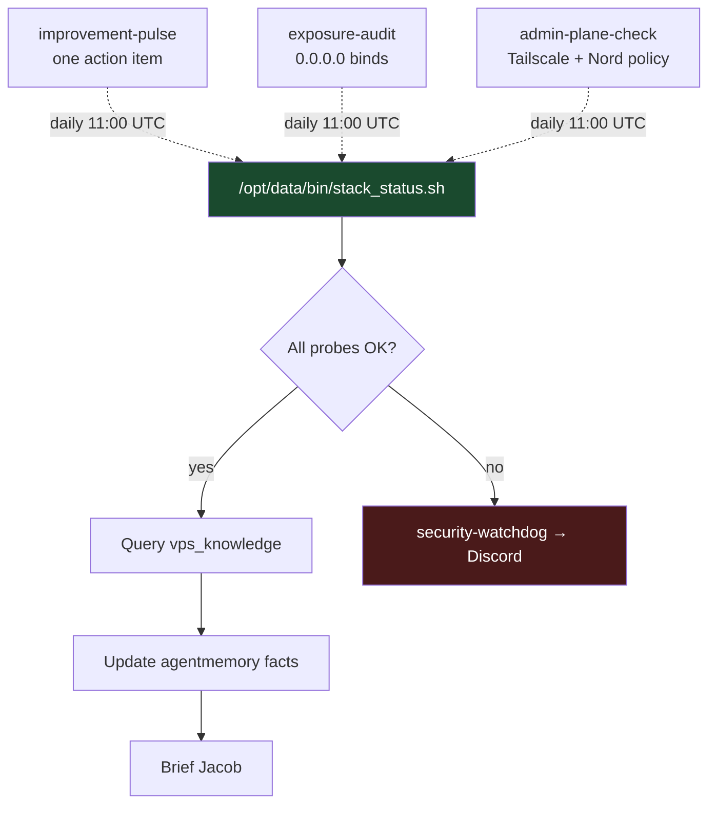
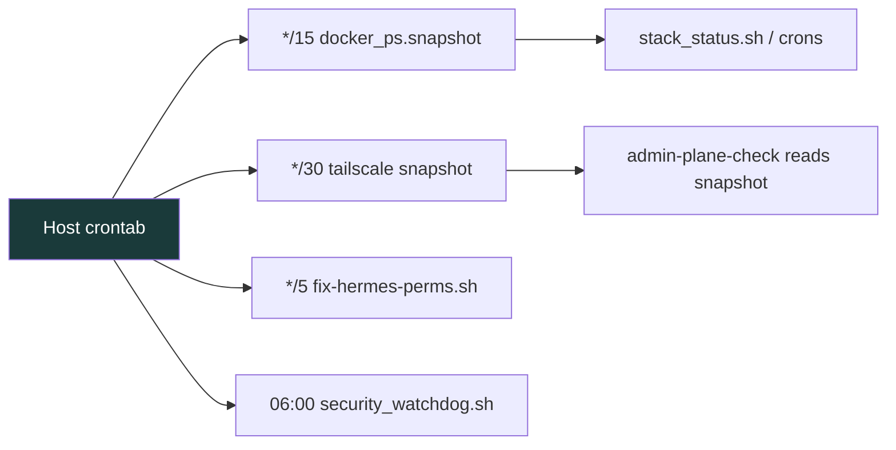
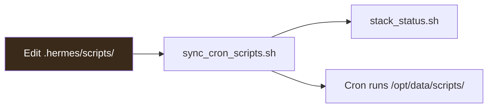

# Hermes Workflow Guide

**Project:** `VPS_Hermes_Project`  

**Author:** Jacob Cowan
**Version:** 8.0
**Last Updated:** June 19, 2026 (final pass — 8 crons, admin plane, visualizations)

---

## The Jacob ↔ Hermes Operating Model



Jacob prompts when needed. Hermes **also runs autonomously** — Sunday familiarization, Monday brief, daily security check, daily tutor resource scan, and a **6:00 AM CDT block** (improvement pulse, exposure audit, admin-plane check). That's the workflow difference.

---

## Admin Plane Workflow



| Step | Action |
|------|--------|
| 1 | Disconnect NordVPN if connected |
| 2 | Verify Tailscale is not `offline` |
| 3 | `ssh vps` (uses `HostName <VPS_TAILSCALE_IP>` — MagicDNS off) |
| 4 | Open admin UIs via Tailscale IP (see monitoring table below) |

Full detail: [SECURITY.md](SECURITY.md#mac-admin-plane-ssh--tailscale) · Aliases.md

---

## Daily Routine



---

## VPS Ops Workflow



### Monitoring surfaces

| Tool | When to check | URL (Mac via Tailscale) |
|------|---------------|-------------------------|
| `stack_status.sh` | Daily / before ops | `/opt/data/bin/stack_status.sh` |
| Netdata | Resource pressure / drill-down | `http://<VPS_TAILSCALE_IP>:19999` |
| Uptime Kuma | Service up/down | `http://<VPS_TAILSCALE_IP>:40307` |
| Beszel | Host capacity trends | `http://<VPS_TAILSCALE_IP>:32769` |
| n8n | Workflow admin | `http://<VPS_TAILSCALE_IP>:32771` |
| Discord `#netdata` | Netdata threshold alerts | Push notifications |

> Mac `~/.ssh/config` uses the Tailscale **IP**, not MagicDNS — see Aliases.md.

---

## Full Cron Schedule

All Hermes schedules are **UTC** on the VPS host. Jacob's wall clock is **CDT (UTC−5 in summer)**.

```mermaid
gantt
    title Hermes + Host Automation (UTC)
    dateFormat HH:mm
    axisFormat %H:%M

    section Sunday
    chroma-reindex 04:00           :04:00, 30m
    stack-familiarization 05:00    :05:00, 45m

    section Daily
    host security_watchdog 06:00   :06:00, 15m
    security-watchdog 06:30        :06:30, 15m
    python-course-scan 09:00       :09:00, 30m
    improvement-pulse 11:00        :11:00, 20m
    exposure-audit 11:10           :11:10, 10m
    admin-plane-check 11:20        :11:20, 10m

    section Monday
    weekly-ops-brief 08:00       :08:00, 30m
```

### Hermes crons (`cron/jobs.json`) — 8 jobs

| Job | ID | Schedule (UTC) | Jacob's time (CDT) | Script | Deliver |
|-----|-----|----------------|-------------------|--------|---------|
| `chroma-reindex` | `7ed56913105e` | Sun 04:00 | Sat 11:00 PM | `chroma_reindex.sh` | local |
| `stack-familiarization` | `a243101413ad` | Sun 05:00 | Sun 12:00 AM | `stack_status.sh` + agent | local |
| `security-watchdog` | `3afb730fa195` | Daily 06:30 | Daily 1:30 AM | `security_watchdog_discord.sh` | Discord |
| `python-course-scan` | `c372ad1ed64d` | Daily 09:00 | Daily 4:00 AM | (agent) | local |
| `weekly-ops-brief` | `ea0342b53406` | Mon 08:00 | Mon 3:00 AM | `stack_status.sh` + agent | Discord |
| `hermes-improvement-pulse` | `ebecfa28836e` | Daily 11:00 | **Daily 6:00 AM** | `hermes_improvement_check.sh` + agent | Discord |
| `exposure-audit` | `46e149d7f26a` | Daily 11:10 | **Daily 6:10 AM** | `exposure_audit_discord.sh` | Discord on alert |
| `admin-plane-check` | `2aa32ff8c08e` | Daily 11:20 | **Daily 6:20 AM** | `admin_plane_check.sh` | Discord on alert |

### Host crontab (not in `jobs.json`)



| Schedule | Command | Purpose |
|----------|---------|---------|
| `0 6 * * *` | `security_watchdog.sh` | Host-level security (separate from Hermes cron) |
| `*/15 * * * *` | `docker ps` → `refresh_docker_snapshot.py` | `docker_ps.snapshot` for container-safe ops |
| `*/30 * * * *` | `tailscale status` → `refresh_tailscale_snapshot.py` | Feeds `admin-plane-check` |
| `*/5 * * * *` | `fix-hermes-perms.sh` | Permission hygiene |

---

## Script workflow



1. Edit `/opt/data/.hermes/scripts/`
2. Run `/opt/data/.hermes/scripts/sync_cron_scripts.sh`
3. Test with `/opt/data/bin/stack_status.sh`
4. Commit `cron/jobs.json` to git backup after schedule changes

---

## Tier selection

**Tier 1 (Mac):** writing, general work  
**Tier 2 (VPS):** security research, Python tutor, always-on ops

---

## Backup (after doc verification)

```bash
cd /opt/data/Projects/VPS_Hermes_Project
git add -A && git commit -m "backup: $(date +%Y-%m-%d)" && git push origin main
```

Never commit `.env`. Push to GitHub only when Jacob says **"push docs"**.

---

*Last audited: June 19, 2026 (final pass)*